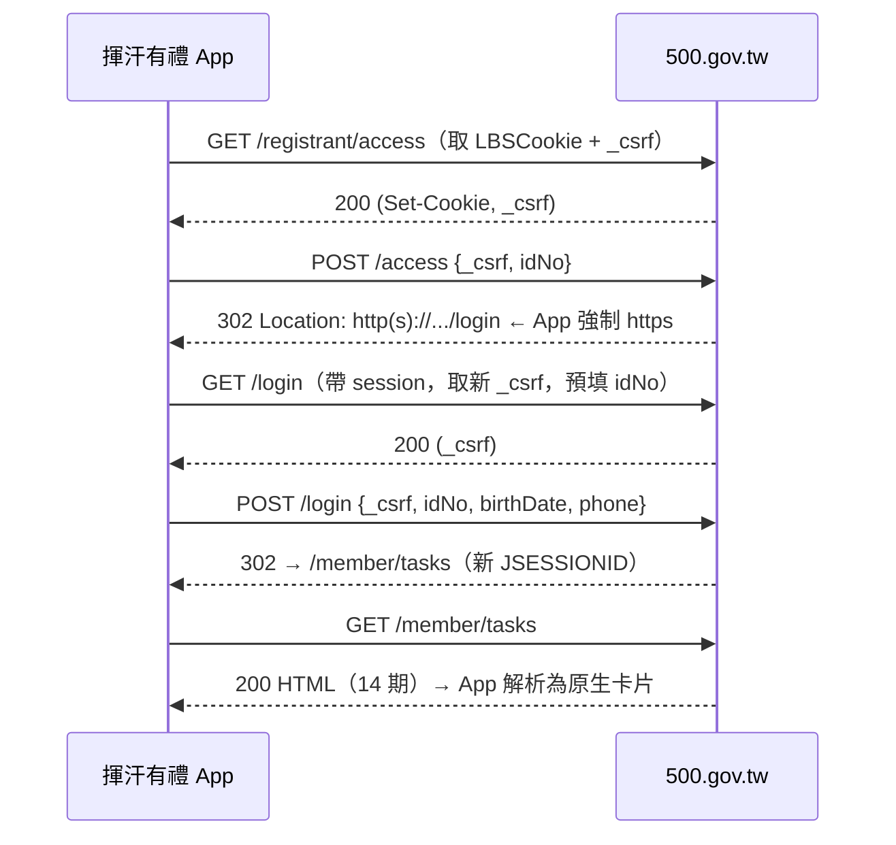
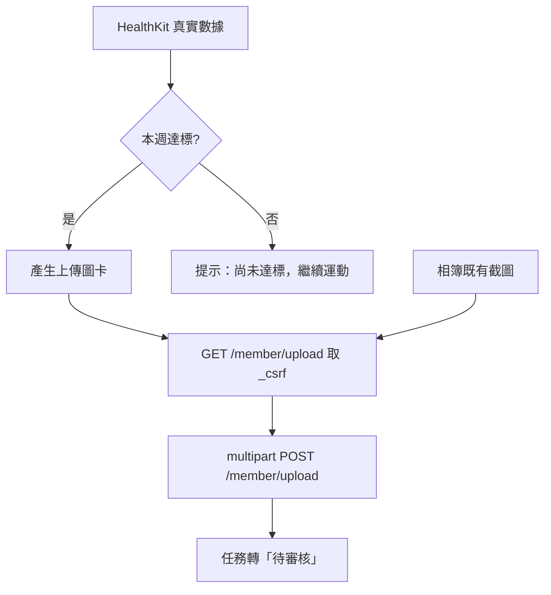

# 揮汗有禮 — 產品需求文件（PRD）

> 加速「揮汗有禮・全民動起來」運動幣加碼活動的 iOS 原生 App，串接 Apple 健康自動產生運動紀錄，個資只留本機、開源可稽核。

---

## 1. 文件資訊與版本

| 欄位 | 內容 |
|---|---|
| 文件名稱 | 揮汗有禮 PRD |
| 版本 | v1.0（送審版，已對齊實作） |
| 撰寫日期 | 2026-09-05 |
| 產品代號 | SportsRewards（技術名）／揮汗有禮（顯示名） |
| 平台 | iOS 原生（SwiftUI，最低 iOS 16） |
| 對接對象 | 運動部「揮汗有禮・全民動起來」官網 `https://500.gov.tw/registrant/` |
| 授權方向 | 開源（安全與可稽核為最高優先） |
| 狀態 | 需求審核中，UI 設計並行進行 |

### 版本紀錄
| 版本 | 日期 | 變更 |
|---|---|---|
| v0.1 | 2026-09-05 | 初版草稿，涵蓋 MVP 全流程與安全架構 |
| v1.0 | 2026-09-05 | 對齊送審版實作：**移除生物辨識鎖與敏感動作再驗證**（`BiometricGate` / `SensitiveAuth` 已刪除）、個資最小化到登入三欄（不再收姓名／Email／健保卡號）、App 不做註冊（導外部 Safari）、加入送審示範模式（`DemoMode`）、上架名定為 Sports Rewards |

---

## 2. 產品願景與目標

### 2.1 願景
官網活動的政策主軸是**「促進國人運動」**——民眾達成運動指標（步數／距離／運動分鐘）即可換取商品券。但現行官網流程的摩擦（每次重複輸入個資、手動截圖、逐頁點選）反而降低了持續運動的誘因。

本 App 的願景是：**把「運動→上傳→領券」的路徑縮到最短，讓 App 成為使用者維持每週運動習慣的驅動器**，同時把個資完全留在使用者自己的裝置上。

### 2.2 產品目標
1. **降低重複勞動**：個資輸入一次，之後每週一鍵登入（官網登入無 OTP，可全自動）。
2. **強化運動誘因**：直接讀 Apple 健康的真實步數／距離／運動時間，即時顯示「本週是否達標」，達標即引導上傳。
3. **忠實產生運動紀錄**：以 HealthKit 真實數據產生「上傳用圖卡」，等同健康 App 截圖的視覺化，不偽造任何數據。
4. **資安與隱私典範**：個資只存本機 Keychain、絕不上雲、絕不寫 log；作為開源專案可被完整稽核。

### 2.3 成功指標（North Star & 輔助）
- **North Star**：使用者「每週完成一次達標上傳」的連續週數（habit streak）。
- 輔助：一鍵登入成功率、從「達標」到「上傳完成」的中位時間（目標 < 30 秒）、每週上傳完成率。
- 反指標（必須為 0）：個資外洩事件、log 中出現敏感欄位、對非 `500.gov.tw` 網域的**非預期**連線。
  - **「非預期」的定義（1.0 更新，2026-09-06）**：Firebase SDK 在**使用者明示同意後**連往 Google 端點屬於**預期內**，
    不計入本指標；未同意時出現任何 Google 端點連線，則計為外洩事件。App 自己的 HTTP client 連往
    非 `500.gov.tw` 網域，一律計為外洩事件（唯一例外是官方回傳的 S3 簽章圖片網址）。

---

## 3. 目標用戶與使用情境

### 3.1 目標用戶
- 已（或將）參加運動幣加碼活動、每週要上傳運動紀錄的一般民眾。
- 有 iPhone 且使用 Apple 健康／Apple Watch 記錄步數運動者。
- 重視個資隱私、對政府活動網站重複填資料感到厭煩的人。

### 3.2 主要使用情境
1. **每週例行（核心）**：週間運動 → 打開 App 看到「本週已達標」→ 產生圖卡 → 一鍵登入並上傳 → 收到「待審核」。
2. **審核通過後兌換**：某期狀態變 REDEEMABLE → 選商店 → 收簡訊 OTP → 出示 QR 到超商折抵。
3. **首次註冊**：~~App 自動填妥註冊三步欄位~~ → **v1.0 不做註冊**。尚未有帳號者由 App 以外部 Safari 開啟官網 `https://500.gov.tw/registrant/access` 自行完成註冊，App 完全不碰健保卡／戶役政／OTP。
4. **換機／重裝**：重新輸入登入三碼（因不上雲、不備份到 iCloud，屬預期行為）即可恢復使用；舊裝置上的資料留在該裝置的 Keychain，不會跟著轉移。

---

## 4. 範圍（Scope）

### 4.1 MVP（本期交付）
- Profile 本機儲存（Keychain，`WhenUnlockedThisDeviceOnly`）。**v1.0 不含生物辨識鎖**（見 §8.1）。
- 一鍵登入（access → login，無 OTP）。
- 任務儀表板（14 期，狀態、倒數、本週置頂）。
- HealthKit 讀取步數／距離／運動時間＋達標判定＋產生上傳圖卡。
- 上傳流程（圖卡或相簿選圖 → 一鍵上傳）。
- 兌換流程（商店選擇 → OTP → QR 券）。
- 券夾。
- 安全與隱私（併入「我的資料」頁：本機資料檢視、一鍵清除、隱私說明；不另開「資安中心」子頁，也不再有生物鎖開關）。

### 4.2 後續（Non-MVP，先不做）
- 首次「註冊」全自動填單（MVP 先支援已註冊者登入；註冊流程列為 Phase 2，因牽涉健保卡／戶役政驗證與 OTP 自動帶入的複雜度）。
- 運動提醒排程與 streak 遊戲化。
- Apple Watch App / Widget / Live Activity 倒數。
- 多帳號（家人代操）——需審慎評估條款（1 門號綁 1 身分證）。

### 4.3 明確不做（Out of Scope）
- 不繞過任何身分驗證（戶役政、健保卡、OTP）。
- 不偽造、竄改或合成運動數據。
- 不蒐集、不上傳任何**個資**到第三方或自建伺服器（本 App **無自建後端**）。健康資料同樣完全不外傳。**匿名、不含個資與健康資料的使用統計除外**——它綁在首次啟動免責聲明的同意之後才初始化，同意後預設開啟、可隨時關閉（見 §8.2）。

---

## 5. 功能需求（逐畫面）

> 每一畫面含：目的、輸入、輸出、狀態、使用者故事、驗收條件（Given/When/Then）。

### 5.1 Onboarding（導覽）
- **目的**：說明三大價值——促進運動、免重複打字、個資只留本機且專案開源。
- **輸入**：無（純瀏覽）。
- **輸出**：進入 Profile 設定或 Home。
- **狀態**：首次啟動顯示；之後不再自動顯示（「重看導覽」入口規劃放在「我的資料 › 安全與隱私」，尚未實作）。
- **使用者故事**：作為新使用者，我想在 30 秒內理解「這 App 會不會偷我的個資」，好安心使用。
- **驗收**：
  - Given 首次安裝，When 啟動 App，Then 顯示 3 頁導覽且明確聲明「個資僅存本機、不上雲、開源可查」。
  - Given 已看過導覽，When 再次啟動，Then 直接進入 Home 不再顯示。

### 5.2 Profile 設定（App 內稱「我的資料」）
- **目的**：一次輸入活動所需個資並存入 Keychain。
- **輸入（v1.0 個資最小化）**：只收登入必需的三欄——身分證號（`[A-Z][12]\d{8}`）、出生日期、手機（`09\d{8}`）。
  - **姓名、Email、健保卡卡號一律不收集**：這三欄只有註冊流程才需要，而 v1.0 不做註冊。`Profile` model 保留這三個欄位（供未來 Phase 2 使用）但 UI 從不寫入，實際存進 Keychain 的值恆為空字串。
- **出生日期輸入**：不用系統日曆式 `DatePicker`，改為欄位點擊 → 開啟自製 sheet（`BirthDatePickerSheet`）：
  - 「年／月／日」三欄滾輪；年份範圍 1912–2009（民國元年起）。
  - 可切換 **民國／西元**（預設民國）；底部固定顯示雙年份確認字串（例「1990 年 5 月 20 日（民國 79 年）」）。
  - 換年／換月時自動夾住不存在的日期（例 3/31 → 2 月時收為 2/28）。
  - 所有文案自備繁體中文、不依賴裝置語系（App 開發語言鎖 `zh-Hant`，並在 App 進入點注入 `Locale(zh_Hant_TW)`）。
  - 對外仍以 ISO `yyyy-MM-dd` 存入 Keychain 與送出（§6.2 登入契約不變）。
  - Onboarding 的個資填寫頁沿用同一元件（`BirthDateField`），樣式與行為一致。
- **輸出**：加密寫入 Keychain；欄位即時格式驗證。
- **狀態**：空 / 編輯中 / 已儲存 / 驗證錯誤。
- **頁首隱私聲明**：標題「本 App 不蒐集、不外傳你的個資」，並明列三點——(a) 開發者沒有任何自建伺服器與後台，個資不上傳雲端、不同步 iCloud、不寫入紀錄檔；(b) 填的資料只在登入當下由這支手機直送官方網站 500.gov.tw；(c) 為免重複輸入，資料僅以加密方式存在本機 Keychain，可隨時用「立即清除本機資料」永久刪除。
  - **文案變更（1.0，2026-09-06）**：原文 (a) 的結尾為「不提供第三方」。加入匿名遙測後，這句話不再無條件成立，須改寫。
    **第二次修訂（遙測預設值改為「同意後預設開啟」）**：原先建議的寫法是「除非你主動開啟下方的『傳送匿名使用統計』，否則不會有任何資料送到第三方」——
    那個版本已經不正確，因為開關現在同意後預設是開的。規格改為：
    「你在首次啟動時同意的免責聲明裡，已經包含『傳送匿名使用統計』這一項，它目前是開著的；不想送隨時可以在下面關掉。
    無論開或關，都絕不包含個資、健康數據、截圖與券碼。」
    **不得使用「除非你主動開啟」「預設關閉」「opt-in」這類措辭。**
    **實際 App 內文案由 `App/Sources/Views/ProfileView.swift` 決定，本節只定義規格。**
  - 用語刻意不寫「不儲存」——本機 Keychain 確實有存，避免文件與實作不符。
- **使用者故事**：作為使用者，我想只填一次資料，之後都不用再打。
- **驗收**：
  - Given 身分證格式錯誤，When 儲存，Then 阻擋並提示，不寫入。
  - Given 全部合法，When 儲存，Then 寫入 Keychain（`WhenUnlockedThisDeviceOnly`、不同步 iCloud），且**任何 log 不得出現欄位值**。
  - Given 已存 Profile，When 重開 App 讀取，Then 直接讀出並以遮罩顯示（點擊欄位才展開明文）；**不再要求 Face ID／Touch ID**——裝置上鎖時 Keychain 的 `WhenUnlockedThisDeviceOnly` 已使本 App 讀不到資料，那才是裝置遺失時的實際界線。
  - Given 在出生日期欄位，When 點擊，Then 開啟三欄滾輪 sheet（非系統日曆），預設以民國年顯示且定位在目前已存日期。
  - Given 滾輪停在民國 79 年 5 月 20 日，When 檢視底部確認列，Then 同時顯示「1990 年 5 月 20 日（民國 79 年）」。
  - Given 已選 3 月 31 日，When 把月份轉到 2 月，Then 日期自動夾為當月最後一天，不會出現不存在的日期。
  - Given 選定日期，When 按「完成」，Then 以 ISO `yyyy-MM-dd` 寫回 Profile，登入送出的 `birthDate` 格式不變。
  - Given 裝置語系為英文，When 開啟出生日期 sheet，Then 年月日與民國／西元切換仍為繁體中文。

### 5.3 Home（首頁）
- **目的**：一眼看到「今天走多少、本週是否達標、要不要登入上傳」。
- **輸入**：HealthKit 今日數據、Profile 是否就緒、登入狀態。
- **輸出**：今日步數 ring、本週達標進度、主要 CTA「一鍵登入 / 前往上傳」。
- **狀態**：未設定 Profile（引導去設定）/ 未授權 HealthKit（引導授權）/ 就緒 / 登入中 / 已登入。
- **健康連結狀態（步數卡）**：三態 `HealthLinkState { checking, linked, notLinked }`——`checking` 是尚未問出授權結果，用來避免冷啟動瞬間閃出「未連結」。
  - `linked`：顯示真實步數環與今日步數／距離／運動時間。
  - `checking` / `notLinked`：步數環改為占位圖案——淺灰虛線圓環＋灰色步行圖示＋「未連結」字樣，整體半透明（opacity 0.55）；`notLinked` 時右側顯示「尚未連結 Apple 健康」說明與「前往連結 ›」（導向健康步數詳情頁）。
  - 未連結時**不顯示任何數據**（不再有示意用的假步數／距離／分鐘）。
- **使用者故事**：作為使用者，我打開 App 就想知道「這週的券我拿到了沒」。
- **驗收**：
  - Given Profile 未建，When 進 Home，Then CTA 導向 Profile 設定。
  - Given 已達標且本週未上傳，When 進 Home，Then 主 CTA 顯示「上傳本週運動紀錄」。
  - Given 一鍵登入，When 點擊，Then 於背景完成 access→login 並進任務儀表板，全程不需人工輸入。
  - Given 未授權 HealthKit，When 進 Home，Then 步數環顯示淺灰虛線占位（半透明、標「未連結」），且畫面上不出現任何步數／距離／運動時間數字。
  - Given 未授權 HealthKit，When 點「前往連結 ›」，Then 進入健康步數詳情頁進行授權。
  - Given 冷啟動、授權狀態尚在確認中，When 首屏繪製，Then 顯示占位環而非「未連結」文字結論，待結果確定後才切成已連結或未連結。

### 5.4 任務儀表板
- **目的**：呈現 14 期任務狀態與時限。
- **輸入**：`GET /member/tasks` 解析結果。
- **輸出**：14 張期別卡片；本週（current）置頂；狀態徽章；倒數。
- **狀態徽章**：`NOT_STARTED 尚未開始` / `OPEN 上傳期開放` / `PENDING 待審核` / `REDEEMABLE 可兌換` / `REDEEMED 已兌換`（實際字串以官網為準）。
- **使用者故事**：作為使用者，我想快速看到「哪一期可以上傳、哪一期可以換券、還剩多少時間」。
- **驗收**：
  - Given 已登入，When 進儀表板，Then 顯示 14 期且 current 期在最上、含倒數。
  - Given 某期 REDEEMABLE，When 點卡片，Then 進兌換流程。
  - Given session 失效，When 載入失敗，Then 顯示可重試並可觸發重新一鍵登入。

### 5.5 健康步數詳情
- **目的**：呈現 HealthKit 明細與達標判定，並產生上傳圖卡。
- **輸入**：`stepCount`、`distanceWalkingRunning`、`appleExerciseTime`（可選日期）。
- **輸出**：達標與否、佐證數據、「產生上傳圖卡」按鈕。
- **達標規則（對應任務辦法，最終以官網公告為準）**：單日步行 ≥ 8,000 步 **或** 單次健走 ≥ 30 分 **或** 跑步 ≥ 5 公里，任一即達標；不同日期／不同筆不得合併。
- **使用者故事**：作為使用者，我想確認「我這週的運動有沒有符合換券條件」。
- **驗收**：
  - Given HealthKit 已授權，When 選定某日，Then 顯示該日真實步數/距離/運動時間並標示是否達標。
  - Given 達標，When 產生圖卡，Then 圖卡含日期＋步數＋距離＋運動時間等審核佐證欄位，數據完全等同 HealthKit（不得修改）。

### 5.6 上傳流程
- **目的**：把運動紀錄送到當期任務。
- **輸入**：上傳圖卡（HealthKit 產生）或相簿既有截圖；當期 upload 頁的 `_csrf`。
- **輸出**：`multipart POST /member/upload`；成功後任務轉「待審核」。
- **狀態**：無可上傳期 / 已上傳（每期限一次）/ 上傳中 / 成功 / 失敗可重試。
- **使用者故事**：作為使用者，我想一鍵把這週的運動紀錄送出。
- **驗收**：
  - Given 當期可上傳且已備圖，When 一鍵上傳，Then 成功並回饋「待審核」。
  - Given 該期已上傳，When 進上傳頁，Then 顯示「每期限一次」不提供表單。
  - **未決**：upload 表單的 file 欄位名待官網有開放期時再補刮確認（見 §14）。

### 5.7 兌換
- **目的**：把 REDEEMABLE 期別換成商品券。
- **輸入**：`GET /member/redeem/{uuid}` 商店清單；選定 `vendorId`＋`item`；`_csrf`；簡訊 OTP。
- **輸出**：`POST /member/redeem/{uuid}` → OTP 驗證 → QR/一維碼券。
- **商店對照**：全家 `vendorId=1`、7-11 `=2`、萊爾富 `=3`、萬家福／樂家康、全聯（`item` 為各檔品項 id）。
- **使用者故事**：作為使用者，我想選好超商、快速拿到能在櫃檯掃的券。
- **驗收**：
  - Given 某期 REDEEMABLE，When 選商店送出，Then 進入 OTP 驗證。
  - Given 收到簡訊，When OTP（可用 iOS 簡訊自動填入）通過，Then 顯示 QR/條碼券並存入券夾。
  - **未決**：兌換後 OTP 端點與券碼取得細節待實測補齊（見 §14）。

### 5.8 券夾
- **目的**：集中管理已取得的券與其狀態。
- **輸入**：已兌換券資料（來源官網頁面解析）。
- **輸出**：券列表、QR/條碼、使用期限、通路。
- **驗收**：Given 已兌換，When 進券夾，Then 可再次出示 QR（每張限一次抵用、不可分次、限本人）。

### 5.9 安全與隱私（併入「我的資料」頁，不另開子頁）
- **目的**：讓使用者掌控自己的資料與信任本 App。
- **位置**：原「設定 — 資安中心」子頁已移除，內容直接展開在「我的資料」（§5.2）頁的「安全與隱私」區塊，少一層導覽即可操作。
- **輸入/功能**：本機資料說明（明列存了哪些欄位）、「立即清除本機資料」（含確認 alert，清除後回到 Onboarding）、頁首隱私說明（§5.2）；區塊底部固定版本與非官方聲明。
  - **已於 1.0 移除**：原「Face ID 解鎖開關」隨生物辨識鎖一併刪除（見 §8.1 決策紀錄）。
  - **待補**：開源 repo 連結、重看導覽兩項尚未實作，補做時一併放在本區塊。
- **驗收**：
  - Given 使用者，When 點「立即清除本機資料」並在確認 alert 按下確定，Then 清空 Keychain 個資、任務快取、健康授權旗標與 HTTP cookie jar，回到初始狀態（Onboarding）。
    - ⚠️ **現況落差（待修）**：`ProfileView.clearLocalData()` 目前只清 Keychain／`TasksCache`／健康旗標，**未呼叫 `HTTPClienting.resetSession()`**，官方站的 session cookie 會殘留到下次登出。需補上才符合本驗收條件。
  - Given 進「我的資料」頁的「安全與隱私」區塊，When 檢視，Then 明列「儲存於 Keychain 的欄位清單」與「本 App 不含後端、不對外傳個資」聲明。
  - Given 使用者想調整安全設定，When 瀏覽 App，Then 不存在獨立的「資安中心」入口或子頁，所有項目都在「我的資料」同一頁完成。

---

## 6. 後端流程對接（技術契約）

> 官網為 **Spring Boot + Thymeleaf 純伺服器渲染，無 JSON API**。所有動作皆為 **HTML form POST + `JSESSIONID` session + 每表單一個 `_csrf` token**。App 必須作為 HTTP client：**先 GET 目標頁刮出 `_csrf`，再帶 cookie jar 進行 POST**。

### 6.1 反爬與連線注意事項
- **HiNetCDN**：首次請求需先取得 `LBSCookie`（官網以 `?_cookie_check=1` 一次 302 換 cookie）。App 的 cookie jar 需保留。
- **HTTP 降級坑**：官網所有 redirect 的 `Location` 為 `http://`，若直接跟隨會遺失 `Secure` cookie 而得到「頁面已過期」。**App 必須強制改寫為 `https://` 或不自動跟隨、改以 session 手動 GET 下一頁**。
- **CSRF**：每次 POST 前都要重新 GET 對應頁面取得最新 `_csrf`。
- **Session**：登入成功會 re-generate `JSESSIONID`；cookie 屬性 `Secure; HttpOnly; SameSite=Lax`。

### 6.2 端點清單（base = `https://500.gov.tw/registrant`）

| 動作 | 方法 | 路徑 | Body / 參數 | 結果 |
|---|---|---|---|---|
| 入口路由 | POST | `/access` | `_csrf, idNo` | 302 → `/login`（已註冊）或 `/register`（未註冊）；`idNo` 寫入 session |
| 登入頁 | GET | `/login` | — | 預填 `idNo` |
| 登入 | POST | `/login` | `_csrf, idNo, birthDate(ISO yyyy-MM-dd), phone(09xxxxxxxx)` | 302 → `/member/tasks`（**三碼比對，無 OTP**） |
| 註冊步1 | POST | `/register` | `_csrf, name, idNo, birthDate, phone, email, agree=true` | → `/register/nhi-verify` |
| 註冊步2 | — | `/register/nhi-verify` | 戶役政生日 + 健保卡卡號 | 真身分驗證（**不可繞**） |
| 註冊步3 | — | `/register/otp` | 111 政府簡訊 OTP（有 resend 倒數、每日門號上限） | 完成註冊 |
| 任務清單 | GET | `/member/tasks` | — | 14 期，每期一個 UUID，含狀態與倒數 |
| 上傳 | GET/POST | `/member/upload` | `multipart`（當期截圖，file 欄位名待補）；每期限一次；**後端自動綁「當前可上傳期」故不帶 UUID** | 成功後轉待審核 |
| 看自己上傳圖 | GET | `/member/screenshot/{uuid}` | — | 302 → S3 presigned 圖片 URL |
| 兌換頁 | GET | `/member/redeem/{uuid}` | — | 商店清單 |
| 兌換 | POST | `/member/redeem/{uuid}` | `_csrf, vendorId, item` | 兌換後再走簡訊 OTP 才出示 QR/一維碼 |

### 6.3 任務狀態機
- `NOT_STARTED`（尚未開始，未來期別）
- `OPEN`（上傳期開放，可上傳，尚未上傳）
- `PENDING`（待審核，已上傳）
- `REDEEMABLE`（審核通過，可兌換）
- `REDEEMED`（已兌換，可於券夾檢視）

> 狀態字串以官網實際回傳為準；App 以「當期可上傳 / 可兌換」的布林旗標驅動 CTA，不自行以日期硬拼條件。

### 6.4 一鍵登入流程（mermaid）

### 6.5 上傳流程（mermaid）

---

## 7. HealthKit 整合

### 7.1 讀取型別（唯讀）
- `HKQuantityTypeIdentifier.stepCount`（步數）
- `HKQuantityTypeIdentifier.distanceWalkingRunning`（步行＋跑步距離）
- `HKQuantityTypeIdentifier.appleExerciseTime`（運動分鐘）

僅要求 **read** 權限，不寫入 HealthKit。

### 7.2 達標判定
- 以「單日」為單位彙總；比對達標規則（§5.5）。
- 不同日期或不同筆不得合併（符合官網任務辦法）。
- 明確處理權限未授權 / 資料為 0 / 部分型別缺失（如無距離）等情況。

### 7.3 上傳圖卡（誠信要求）
- 圖卡是 HealthKit 真實數據的**視覺化呈現**，等同健康 App 截圖，含審核佐證欄位：**日期、步數、距離、運動時間**。
- **嚴禁**任何加工造假；數值一律直接來自 HealthKit 查詢結果。
- 官網條款明訂「以冒用、偽造或其他不正當方式參與，查證屬實將取消資格及後續運動幣參加權益」——App 設計不得提供任何可竄改數據的入口。

---

## 8. 安全架構與威脅模型（最高優先）

> 本專案將開源，安全性須可被第三方完整稽核。原則：**本 App 無自建後端、個資只留本機、絕不寫 log、App 自己只連 `500.gov.tw`。**
>
> **原則變更（1.0，2026-09-06）**：原文為「只連 `500.gov.tw`」。加入 Firebase Analytics／Crashlytics 後，
> 這句話的範圍必須收斂成「**App 自己的 HTTP client** 只連 `500.gov.tw`」——網域白名單是 `URLSessionHTTPClient`
> 裡的檢查，管不到 Firebase SDK 自己的 `URLSession`。使用者開啟遙測後，SDK 會另連 Google 的端點。
> 詳見 §8.2 的決策紀錄。

### 8.1 個資儲存
- 敏感個資只存 **iOS Keychain**。v1.0 實際寫入的只有**身分證號、出生日期、手機**三欄（姓名／Email／健保卡卡號不收集，見 §5.2）。
- Keychain 屬性：`kSecAttrAccessibleWhenUnlockedThisDeviceOnly`（裝置解鎖時可用、**不同步 iCloud、不隨備份轉移**）。
- **不使用生物辨識**（無 `LocalAuthentication`／`LAContext`，Keychain item 也不掛 `kSecAccessControl` biometry）。
  - **決策紀錄（1.0 移除）**：原設計要求存取前通過 Face ID／Touch ID，並在「進個資頁／存個資／兌換」三處做敏感動作再驗證（`BiometricGate`、`SensitiveAuthCoordinator`）。1.0 全數移除，理由：(a) 登入三碼是使用者本人記得、且官方網站登入本身也只驗這三碼的資料，App 內再擋一次不改變裝置遺失時的實際暴露面；(b) 裝置遺失的真正界線是 **iOS 鎖屏 + `WhenUnlockedThisDeviceOnly`**——裝置上鎖時連本 App 都讀不到 Keychain；(c) 移除後 `NSFaceIDUsageDescription` 也一併拿掉，減少送審時需要解釋的權限面。
  - 替代防線：iOS 裝置鎖屏、`WhenUnlockedThisDeviceOnly`（不同步 iCloud、不隨備份轉移）、「立即清除本機資料」。
- 絕不寫入 `UserDefaults`、plist、明文檔案或 iCloud。

### 8.2 日誌遮罩規則（絕不落 log）
- **禁止寫入 log 的欄位**：身分證、出生日期、手機、Email、健保卡號、cookie（`LBSCookie`/`JSESSIONID`）、`_csrf`、OTP、session 內容、presigned URL。
- 遮罩規則：如需除錯，一律以 `****` 或雜湊前綴呈現（例：身分證僅顯示 `A1***`）。
- **Release build 關閉所有敏感 log**；統一走一個 `Redactor`/`SecureLog` 封裝，禁止直接 `print`/`NSLog` 敏感物件。
- ~~**禁用**會外傳個資的第三方 analytics / crash SDK；若需 crash 收集，須本機化且不含個資。~~
  **此硬約束已於 1.0 變更（2026-09-06）。** 保留原文以維持決策軌跡。

  **變更後的規則**：允許第三方 analytics / crash SDK，但必須同時滿足以下六條，缺一不可。
  1. **初始化必須綁在「使用者已讀到揭露並主動同意」之後**（2026-09-06 二次修訂；原文為「預設關閉（opt-in）」，見下方決策紀錄）。
     具體實作：首次啟動先擋一張必須主動勾選的免責聲明（`App/Sources/Views/DisclaimerView.swift`），畫面上明寫會把匿名操作紀錄與當機報告送給
     Google Firebase；使用者按下「同意並開始使用」時，`DisclaimerConsent.record()` 才呼叫 `Telemetry.configure()`。
     **在那之前，Firebase 一行程式碼都不會執行，一個位元組都不送。**
     `Telemetry.configure()` 有三道前置條件，缺一不初始化：尚未同意免責聲明／使用者關掉開關／示範模式。
     `Telemetry.defaultEnabled` 為 `true`——**同意之後預設開啟**，使用者可隨時到「我的資料 › 安全與隱私 › 傳送匿名使用統計」關閉。
     Info.plist 的 `FIREBASE_ANALYTICS_COLLECTION_ENABLED`、`FirebaseCrashlyticsCollectionEnabled`、
     `GOOGLE_ANALYTICS_IDFV_COLLECTION_ENABLED`、`GOOGLE_ANALYTICS_DEFAULT_ALLOW_AD_PERSONALIZATION_SIGNALS` 仍全為 `false`：
     那是**冷啟動的預設值**，由 `applyCollectionFlags` 在初始化後依使用者偏好覆寫，用來守住「還沒 `configure()` 就絕不收集」——
     **它們不再代表「預設關閉」**。對外文案一律寫「先告知 → 主動同意 → 預設開啟 → 隨時可關」，**不得寫「opt-in」或「預設關閉」**。
  2. **個資零外傳**。身分證號、出生日期、手機號碼的任何形式（原文、雜湊、截斷、拼接）都不得進入遙測。
  3. **HealthKit 資料零外傳**，且**連由健康資料推導出來的結論也不得外傳**（例如「今日是否達標」這個布林）。
     理由不是偏好，是 Apple Guideline 5.1.3 明文禁止把 HealthKit 資料分享給第三方。
  4. **單一出口 + 封閉列舉**。全 App 只有一個檔案（`App/Sources/App/Telemetry.swift`）可以 import 遙測 SDK；
     事件名、參數值、使用者屬性、crash key 全部是封閉列舉，自由字串在編譯期就送不出去。
  5. **六道閘門**：示範模式 → 截圖模式 → 使用者關閉 → 未初始化 → 參數命中 `Redact` 敏感樣式 → 整數值域白名單（最後兩道在 DEBUG 直接 `assertionFailure`）
     （最後一道在 DEBUG build 直接 `assertionFailure`，讓錯誤在開發期爆出來而不是在正式版靜靜被丟掉）。
  6. **不得引入廣告識別能力**。使用 `FirebaseAnalyticsCore`（底層 `GoogleAppMeasurementCore`）而非 `FirebaseAnalytics`，
     二進位不得連結 `AdSupport`／`AppTrackingTransparency`／`AdServices`。

  **決策紀錄（1.0 變更，2026-09-06）**
  - **為什麼改**：官網是純 HTML 刮取的對象，改版就會整個功能失效；沒有任何遙測時，我們只能等使用者來信才知道
    解析器壞了，而使用者通常是站在超商櫃檯前發現的。1.0 需要一條「官網改版時最早的警報」。
    完整的量測目標與事件設計見 `docs/analytics-plan.md`。
  - **考慮過的替代方案**：`analytics-plan.md` §8 的零 SDK 方案（MetricKit + App Store Connect 分析 + Xcode Organizer
    + CI 端 parser 冒煙測試）。它不動任何承諾，但拿不到事件層級的漏斗，也無法區分「官網改版」與「使用者網路不好」。
  - **代價（誠實記錄，不粉飾）**：
    (a) 「零第三方相依」這個乾淨的辯護點沒有了，README、CHANGELOG、官網、隱私政策、隱私標籤、Review Notes 全部改寫過；
    (b) 隱私標籤四格從 Not Collected 變成 Collected（Identifiers › Device ID、Usage Data › Product Interaction、
        Diagnostics › Crash Data／Other Diagnostic Data），從此必須與實作逐格一致，填錯就是 metadata 違規；
    (c) 帶 HealthKit entitlement 的 App 裡出現 Google SDK，5.1.3(i) 從「不必解釋」變成「必須主動解釋」；
    (d) 樣本偏向不去關掉開關的人，安裝數分母仍建議從 App Store Connect 拿，審查期間的當機也收不到（示範模式擋住了）。
  - **二次修訂（2026-09-06，遙測預設值）**：`Telemetry.defaultEnabled` 由 `false` 改為 `true`，並把初始化時機綁到免責聲明的同意上。
    - **為什麼改**：原本的「預設關 + 開關藏在設定頁第三層」在實務上等於沒有人會打開，當機報告拿不到有意義的樣本，
      §8.2 加遙測的整個理由（官網改版的最早警報）也就落空。改成把揭露拉到 App 的必經入口、由使用者主動同意，
      再預設開啟——實際知情程度比舊設計高，而收得到的資料也才有用。
    - **誠實記錄**：對使用者而言這確實是「預設會送」。**不要用「仍然是 opt-in」這種說法**，它已經不是 opt-in，
      而是「knowing consent + opt-out」。真正的保障是**同意之前 Firebase 一行程式碼都不執行**，不是預設值。
    - **新增的代價**：(e) App Store 審查員實際體驗到的行為改變了——他會先同意免責聲明（Firebase 於此初始化、
      送出 `first_open`、Installations 連線一次），**之後**才在 Onboarding 的登入表單進入示範模式。
      所以舊文件寫的「示範模式下對 Google 零連線」已不成立，`docs/release/review-notes.md` 已改為主動向審查員說明這個時序。
      進入示範模式之後仍然一個事件都不送（`Telemetry.gate` 第一道，唯一沒有 bypass 的閘門）。
  - **不變的部分**：個資與健康資料仍然完全不外傳。這一點沒有因為這次變更打任何折扣，
    隱私標籤的 Health / Fitness 兩格仍是 Not Collected。

### 8.3 網路安全
- **網域白名單**：`URLSessionHTTPClient` 只允許連 `500.gov.tw`（含其 CDN/S3 presigned 圖片網域，需明列於允許清單）。
  - **界線（1.0 變更後必須寫清楚）**：這個白名單是 App 自己 HTTP client 裡的檢查，**只管 App 自己發出的請求**。
    Firebase SDK 使用自己的 `URLSession`，**不受白名單管轄**。遙測運作時，SDK 會連往
    `app-analytics-services.com`、`firebaseinstallations.googleapis.com`、`firebase-settings.crashlytics.com`、
    `crashlyticsreports-pa.googleapis.com`、`firebaselogging.googleapis.com`（ATS 仍強制 HTTPS）。
    這不是白名單被放寬，而是白名單從來就不涵蓋 SDK 內部連線——這個區別必須在所有對外文件裡講明，不能靠沉默。
- **ATS 強制 https**：`NSAllowsArbitraryLoads=false`；針對官網 redirect 的 http 降級由 App 層改寫為 https，而非放寬 ATS。
- Cookie 存於 App 沙盒容器（受 iOS 檔案保護，不進 iCloud），讓登入 session 可跨啟動續用；**登出 `resetSession()` 即清空 cookie/cache/憑證**。（`URLSessionHTTPClient(persistCookies: false)` 可退回純記憶體 ephemeral，供測試使用。）
- 不硬編碼任何密鑰／token（本 App 本就無需伺服器密鑰）。

### 8.4 STRIDE 威脅模型（簡表）
| 威脅 | 情境 | 對策 |
|---|---|---|
| **S**poofing 假冒 | 中間人假冒官網 | ATS + https、網域白名單；官網為政府憑證 |
| **T**ampering 竄改 | 竄改運動數據上傳 | 數據唯讀取自 HealthKit，無竄改入口；忠實呈現 |
| **R**epudiation 否認 | 使用者否認操作 | 本機無需審計；官網端自有紀錄 |
| **I**nfo Disclosure 資訊揭露 | 個資外洩、log 洩漏、**個資誤入遙測** | Keychain（`WhenUnlockedThisDeviceOnly`，裝置上鎖即不可讀）+ 裝置鎖屏、遮罩規則、無自建後端；遙測方面：單一出口 + 封閉列舉（型別限制優先於遮罩）+ 六道閘門 + DEBUG `assertionFailure`，且初始化綁在免責聲明同意之後（同意前一行不執行，見 §8.2） |
| **D**oS 阻斷 | 過度打 OTP / 官網 | 尊重官網每日 OTP 上限與 resend 倒數，不自動重試轟炸 |
| **E**levation 提權 | 越權存取他人資料 | 只操作本機使用者自己的帳號；不支援批量／代操 |

### 8.5 開源治理交付物
- `LICENSE`（建議 MIT 或 Apache-2.0，待定）。
- `README.md`：含**威脅模型摘要**、資料流圖、「無自建後端、個資不上雲」聲明、第三方相依與遙測邊界的如實說明、建置與稽核指引。
- `SECURITY.md`：漏洞回報流程。
- CI 檢查：無硬編碼密鑰（secret scan）、log 遮罩 lint 規則、**遙測不變量檢查**——
  `DisclaimerConsent.record()` 內含 `Telemetry.configure()`、`Telemetry.configure()` 的三道 guard（未同意／使用者關閉／示範模式）都在、
  `DisclaimerView` 的揭露文案含「匿名使用統計」字樣、Info.plist 四個 Firebase 旗標為 `false`、
  `Telemetry.swift` 以外的檔案沒有 `import FirebaseAnalytics` / `import FirebaseCrashlytics`、
  二進位未連結 `AdSupport`／`AppTrackingTransparency`／`AdServices`。`TODO(待確認：這條 CI 檢查尚未建立)`

---

## 9. 資料模型（本機儲存欄位）

### 9.1 Keychain — Profile（敏感；由裝置鎖屏 + `WhenUnlockedThisDeviceOnly` 保護，無生物辨識層）
| 欄位 | 型別 | 格式/驗證 | 用途 |
|---|---|---|---|
| `name` | String | 非空 | 註冊（**v1.0 不收集，恆為空字串**） |
| `idNo` | String | `[A-Z][12]\d{8}` | 登入/註冊 |
| `birthDate` | Date | 送出轉 ISO `yyyy-MM-dd` | 登入/註冊 |
| `phone` | String | `09\d{8}` | 登入/註冊 |
| `email` | String | Email 格式 | 註冊（**v1.0 不收集，恆為空字串**） |
| `nhiCardNo` | String | 健保卡卡號 | 註冊/兌換備用（**v1.0 不收集，恆為空字串**） |

### 9.2 Session 狀態（登出即清）
| 欄位 | 說明 |
|---|---|
| cookie jar | `LBSCookie`、`JSESSIONID`；存於 App 沙盒容器（跨啟動續用），`resetSession()` 清空 |
| `_csrf` | 每頁最新 token |
| 登入狀態 | 是否已進入 member 區 |

### 9.3 本機非敏感快取（可存，但避免個資）
| 欄位 | 說明 |
|---|---|
| 任務儀表板快照 | 14 期狀態（不含個資），供離線顯示 |
| 券夾 | 已兌換券的通路/期限/QR（評估是否列敏感） |
| App 設定 | 是否看過導覽（`hasCompletedOnboarding`）、健康授權旗標、示範模式旗標（`demoModeEnabled`）；**生物鎖開關已於 1.0 移除** |

---

## 10. 非功能需求

- **效能**：一鍵登入端到端 < 5 秒（視官網回應）；「達標→上傳完成」中位 < 30 秒。
- **無障礙**：符合 WCAG / iOS 無障礙 AA；VoiceOver 標籤、Dynamic Type、對比度。
- **離線**：無網路時顯示上次任務快照與明確離線提示；HealthKit 讀取與圖卡產生可離線完成。
- **穩定性**：官網結構變動（HTML 改版）要能優雅失敗並提示，不 crash；解析器集中管理便於維護。
- **相容**：iOS 16+；深色模式；多尺寸機型。

---

## 11. 法遵與倫理

- 遵守官網條款：**1 組門號僅能綁定 1 組身分證號、不得盜用他人個資**；本 App 僅自動化**使用者本人**帳號，屬正當個人自動化。
- 不繞過身分驗證（戶役政／健保卡／OTP）——這些是真實驗證，設計上不提供繞過。
- 尊重官網速率限制（每日 OTP 上限、resend 倒數、CDN/session），不做輪詢轟炸。
- 誠信上傳：數據忠實來自 HealthKit，不偽造。
- 隱私最小化：只讀達標所需的 HealthKit 型別、只存活動所需個資。

---

## 12. 開源治理

- Repo 結構：`/app`（Xcode 專案）、`/docs`（PRD、設計、逆向筆記）、`SECURITY.md`、`LICENSE`、`README.md`。
- 貢獻規範：PR 需通過 secret scan 與 log 遮罩 lint。
- 逆向筆記以「公開資訊 + 使用者自身操作」為界線，不含任何他人資料。
- 明確聲明：本專案為社群便利工具，與運動部無官方隸屬關係。

---

## 13. 里程碑

| 階段 | 內容 | 產出 |
|---|---|---|
| M0 | PRD 確認 + UI 設計確認 | 本文件 + design canvas |
| M1 | 安全地基 | Keychain 封裝、SecureLog/Redactor、網域白名單、ATS |
| M2 | 一鍵登入 + 任務儀表板 | access→login、`/member/tasks` 解析、狀態卡片 |
| M3 | HealthKit + 上傳圖卡 | 讀取/達標/圖卡、`multipart /member/upload` |
| M4 | 兌換 + 券夾 | redeem + OTP + QR |
| M5 | 安全與隱私（併入「我的資料」）+ 開源交付 | 一鍵清除、README/威脅模型、CI 檢查 |
| Phase 2 | 註冊全自動填單 | `/register/*` 三步自動填 |

---

## 14. 風險與未決問題

| # | 項目 | 狀態 | 說明/待辦 |
|---|---|---|---|
| R1（已解決 2026-09-05：file 欄位名 `screenshot`；multipart POST /member/upload→302 tasks） | 上傳 `multipart` 的 **file 欄位名** | **待補** | 目前測試帳號當期已上傳、其餘期未開放，抓不到「可上傳」表單。待有開放期時再刮頁確認欄位名與其他 hidden 參數。 |
| R2 | 兌換後 **OTP 端點與券碼取得** | **待驗** | 已知兌換後需再走簡訊 OTP 才出示 QR；OTP 送出/驗證的實際端點與券碼頁面結構待實測（避免消耗真實兌換次數）。 |
| R3 | 官網 **HTML 改版** | 風險 | 純刮頁對結構敏感；解析器需集中、容錯、可快速更新。 |
| R4 | **OTP 每日門號上限** | 限制 | 兌換/註冊 OTP 有每日上限與 resend 倒數；App 需顯示倒數、不自動重送。 |
| R5 | 達標規則以官網公告為準 | 待確認 | §5.5 規則需與最新任務辦法核對，避免誤判達標。 |
| R6 | 券夾是否含敏感資料 | 待評估 | QR/券碼是否視為敏感、是否需 Keychain 保護，待定。 |
| R7 | Phase 2 註冊自動化的健保卡驗證 | 待評估 | 健保卡號屬高敏感，UI/儲存與 OTP 自動帶入流程需再設計。 |
