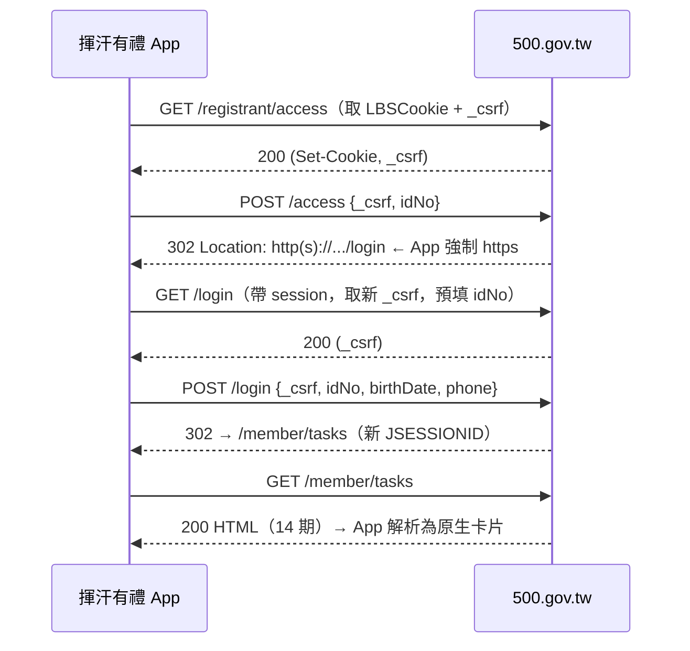
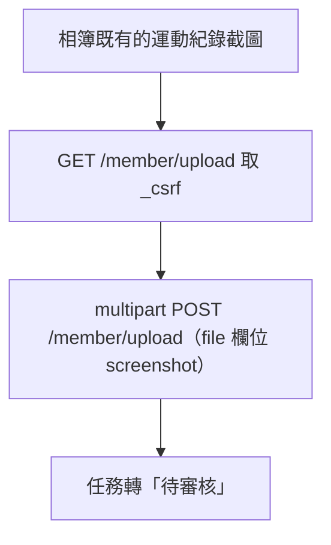

# 揮汗有禮 — 產品需求文件（PRD）

> 加速「揮汗有禮・全民動起來」運動幣加碼活動的 iOS 原生 App：一鍵登入、看懂 14 期任務、挑品項兌換、管理加碼券。個資只留本機、開源可稽核。
>
> ⚠️ **本文件含歷史內容**：v1.1 已**完全移除 HealthKit／健康連結**（見下方版本紀錄）。
> §5.5、§7 與 §2.2 第 2、3 點描述的是 v1.0 的設計，保留是為了說明當初為什麼那樣做、以及移除掉了什麼；
> **不要當成現況實作**。凡與現況衝突之處，一律以標了「已移除」的段落為準。
>
> ⚠️ **v1.2（2026-09-09）另有兩處行為改變，讀 §5 時請一併注意**：
> 「我的資料」頁已改為**唯讀**（§5.2，個資唯一寫入點是 §5.1 的 Onboarding），
> 且「立即清除本機資料」已改名為**「立即登出並清除本機資料」**並獨立成「換帳號」區塊（§5.9）。
> 全 App 也多了一條白名單外的唯讀網路出口（§8.3）。

---

## 1. 文件資訊與版本

| 欄位 | 內容 |
|---|---|
| 文件名稱 | 揮汗有禮 PRD |
| 版本 | v1.0（送審版，已對齊實作） |
| 撰寫日期 | 2026-09-05 |
| 產品代號 | ExerciseRewards（技術名）／揮汗有禮（顯示名） |
| 平台 | iOS 原生（SwiftUI，最低 iOS 16） |
| 對接對象 | 運動部「揮汗有禮・全民動起來」官網 `https://500.gov.tw/registrant/` |
| 授權方向 | 開源（安全與可稽核為最高優先） |
| 狀態 | 需求審核中，UI 設計並行進行 |

### 版本紀錄
| 版本 | 日期 | 變更 |
|---|---|---|
| v0.1 | 2026-09-05 | 初版草稿，涵蓋 MVP 全流程與安全架構 |
| v1.0 | 2026-09-05 | 對齊送審版實作：**移除生物辨識鎖與敏感動作再驗證**（`BiometricGate` / `SensitiveAuth` 已刪除）、個資最小化到登入三欄（不再收姓名／Email／健保卡號）、App 不做註冊（導外部 Safari）、加入送審示範模式（`DemoMode`）、上架名定為 Exercise Rewards |
| v1.1 | 2026-09-06 | **移除 HealthKit／健康連結整個功能**（entitlement、權限用途字串、健康分頁、首頁步數環、`HealthReading`／`GoalEvaluator`、遙測 E9/E10 全部刪除）；**首頁改為「本週任務＋加碼券清單」**（未兌換優先、建立時間由舊到新、最多五列）；**兌換頁每列新增「兌換品項」**，開官網 `/intro/vendor-{id}.html` 解析出的可兌換商品分類與品項 |
| v1.2 | 2026-09-09 | **「我的資料」頁改為唯讀**（三欄不再可編輯、移除「儲存到本機」，個資唯一寫入點是 Onboarding 首次設定）；**「立即清除本機資料」改名為「立即登出並清除本機資料」**並從「安全與隱私」清單移出、獨立成「換帳號」區塊；**券夾**已兌換券卡的「檢視券碼」改名「顯示加碼券條碼結帳」、新增「查看可兌換品項」；**任務卡的「檢視加碼券」改為只切到券夾分頁**（新增 `RootTab`／`TabRouter`，券碼頁關閉一律導回券夾）；新增本機紀錄 `VendorIntroStore` 與離線備份 `VendorCatalogService`（**全 App 唯一離開 `500.gov.tw` 的請求**，見 §8.3） |

---

## 2. 產品願景與目標

### 2.1 願景
官網活動的政策主軸是**「促進國人運動」**——民眾達成運動指標（步數／距離／運動分鐘）即可換取商品券。但現行官網流程的摩擦（每次重複輸入個資、手動截圖、逐頁點選）反而降低了持續運動的誘因。

本 App 的願景是：**把「運動→上傳→領券」的路徑縮到最短，讓 App 成為使用者維持每週運動習慣的驅動器**，同時把個資完全留在使用者自己的裝置上。

### 2.2 產品目標
1. **降低重複勞動**：個資輸入一次，之後每週一鍵登入（官網登入無 OTP，可全自動）。
2. **強化運動誘因**：直接讀 Apple 健康的真實步數／距離／運動時間，即時顯示「本週是否達標」，達標即引導上傳。
3. **忠實產生運動紀錄**：以 HealthKit 真實數據產生「上傳用圖卡」，等同健康 App 截圖的視覺化，不偽造任何數據。
4. **資安與隱私典範**：個資只存本機 Keychain、絕不上雲、絕不寫 log；作為開源專案可被完整稽核。

### 2.3 成功指標（North Star & 輔助）
- **North Star**：使用者「每週完成一次達標上傳」的連續週數（habit streak）。
- 輔助：一鍵登入成功率、從「達標」到「上傳完成」的中位時間（目標 < 30 秒）、每週上傳完成率。
- 反指標（必須為 0）：個資外洩事件、log 中出現敏感欄位、對非 `500.gov.tw` 網域的**非預期**連線。
  - **「非預期」的定義（1.0 更新，2026-09-06）**：Firebase SDK 在**使用者明示同意後**連往 Google 端點屬於**預期內**，
    不計入本指標；未同意時出現任何 Google 端點連線，則計為外洩事件。App 自己的 HTTP client 連往
    非 `500.gov.tw` 網域，一律計為外洩事件（唯一例外是官方回傳的 S3 簽章圖片網址）。
  - **補充（1.2 更新，2026-09-09）**：`VendorCatalogService` 對 `megshao.github.io` 的**唯讀**目錄備份請求屬**預期內**
    （只下載零上傳、不帶 cookie、不含個資，且只在補不到品項頁時才發；見 §8.3）。它**不在** `URLSessionHTTPClient`
    的主機白名單內，也不共用它的 cookie jar——這一點是刻意的，不是白名單被放寬。
    示範模式走 `EmptyVendorCatalogService`，一個請求都不發；示範模式下出現任何對外連線仍計為外洩事件。

---

## 3. 目標用戶與使用情境

### 3.1 目標用戶
- 已（或將）參加運動幣加碼活動、每週要上傳運動紀錄的一般民眾。
- 有 iPhone 且使用 Apple 健康／Apple Watch 記錄步數運動者。
- 重視個資隱私、對政府活動網站重複填資料感到厭煩的人。

### 3.2 主要使用情境
1. **每週例行（核心）**：週間運動 → 打開 App 看到「本週已達標」→ 產生圖卡 → 一鍵登入並上傳 → 收到「待審核」。
2. **審核通過後兌換**：某期狀態變 REDEEMABLE → 選商店 → 收簡訊 OTP → 出示 QR 到超商折抵。
3. **首次註冊**：~~App 自動填妥註冊三步欄位~~ → **v1.0 不做註冊**。尚未有帳號者由 App 以外部 Safari 開啟官網 `https://500.gov.tw/registrant/access` 自行完成註冊，App 完全不碰健保卡／戶役政／OTP。
4. **換機／重裝**：重新輸入登入三碼（因不上雲、不備份到 iCloud，屬預期行為）即可恢復使用；舊裝置上的資料留在該裝置的 Keychain，不會跟著轉移。

---

## 4. 範圍（Scope）

### 4.1 MVP（本期交付）
- Profile 本機儲存（Keychain，`WhenUnlockedThisDeviceOnly`）。**v1.0 不含生物辨識鎖**（見 §8.1）。
- 一鍵登入（access → login，無 OTP）。
- 任務儀表板（14 期，狀態、倒數、本週置頂）。
- ~~HealthKit 讀取步數／距離／運動時間＋達標判定＋產生上傳圖卡。~~ **v1.1 整個移除**（見 §7）。
- 上傳流程（相簿選圖 → 一鍵上傳）。
- 兌換流程（查看可兌換品項 → 商店選擇 → OTP → QR 券）。
- 券夾（出示加碼券條碼、查看可兌換品項、「已使用」本機標記）。
- 安全與隱私（併入「我的資料」頁：本機個資**唯讀**檢視、隱私說明、匿名使用統計開關、原始碼連結；不另開「資安中心」子頁，也不再有生物鎖開關）。
- 換帳號（「我的資料」頁上的獨立區塊，唯一動作是「立即登出並清除本機資料」；見 §5.9）。

### 4.2 後續（Non-MVP，先不做）
- 首次「註冊」全自動填單（MVP 先支援已註冊者登入；註冊流程列為 Phase 2，因牽涉健保卡／戶役政驗證與 OTP 自動帶入的複雜度）。
- 運動提醒排程與 streak 遊戲化。
- Apple Watch App / Widget / Live Activity 倒數。
- 多帳號（家人代操）——需審慎評估條款（1 門號綁 1 身分證）。

### 4.3 明確不做（Out of Scope）
- 不繞過任何身分驗證（戶役政、健保卡、OTP）。
- 不偽造、竄改或合成運動數據。
- 不蒐集、不上傳任何**個資**到第三方或自建伺服器（本 App **無自建後端**）。**匿名、不含個資的使用統計除外**——它綁在首次啟動免責聲明的同意之後才初始化，同意後預設開啟、可隨時關閉（見 §8.2）。
- 不讀取任何健康資料（v1.1 起，連 HealthKit 權限都不申請）。

---

## 5. 功能需求（逐畫面）

> 每一畫面含：目的、輸入、輸出、狀態、使用者故事、驗收條件（Given/When/Then）。

### 5.1 Onboarding（導覽）
> **v1.1 改版**：首次啟動順序改為 **歡迎 → 免責聲明 → 個資填寫**（原本第一個畫面就是免責聲明）。
> 歡迎頁拆到 `WelcomeView`，圖示用 App icon 本體。
> 免責聲明仍是阻斷式、仍擋在任何資料輸入之前，`Telemetry.configure()` 仍只在同意時執行。
> 代價：歡迎頁在同意之前，不能埋任何遙測；`tutorial_begin` 因此移到表單出現時才送。

- **目的**：說明三大價值——促進運動、免重複打字、個資只留本機且專案開源；並完成**個資的首次（且唯一）填寫**。
- **輸入**：歡迎頁與免責聲明為純瀏覽；個資填寫頁收登入必需的三欄（規格見 §5.2「欄位規格」）。
- **輸出**：驗證成功即寫入 Keychain 並進 Home。
- **狀態**：首次啟動顯示；之後不再自動顯示（「重看導覽」入口規劃放在「我的資料 › 安全與隱私」，尚未實作）。
- **個資寫入點（1.2 起唯一）**：`OnboardingViewModel.submitTapped()` 是全 App **唯一**會寫 Keychain 個資的地方。
  「我的資料」頁自 1.2 起唯讀（見 §5.2 決策紀錄），所以填錯要改的正確做法是「立即登出並清除本機資料」後重新登入。
- **表單焦點行為（1.2 新增）**：出生日期滾輪按下「完成」後，焦點自動移到「手機號碼」——滾輪是這張表單裡唯一
  「填完不會自然接到下一格」的欄位（不吃鍵盤，也就沒有 next／return）。實作細節有兩點是刻意的：
  - 焦點在 sheet 的 `onDismiss` 才取得，**不在「完成」的 action 裡設**——那時 sheet 還在關閉動畫中，剛設好的焦點會被它一起帶走。
  - 按「取消」**不移動焦點**（`BirthDateField` 以 `didCommit` 區分兩條路）。
- **使用者故事**：作為新使用者，我想在 30 秒內理解「這 App 會不會偷我的個資」，好安心使用。
- **驗收**：
  - Given 首次安裝，When 啟動 App，Then 依序顯示歡迎 → 免責聲明 → 個資填寫，且明確聲明「個資僅存本機、不上雲、開源可查」。
  - Given 已看過導覽，When 再次啟動，Then 直接進入 Home 不再顯示。
  - Given 在個資填寫頁選定出生日期，When 按滾輪的「完成」，Then sheet 收起後焦點落在「手機號碼」欄位、鍵盤已開啟。
  - Given 在個資填寫頁開了出生日期滾輪，When 按「取消」，Then 焦點不移動、不開啟鍵盤。

### 5.2 Profile（App 內稱「我的資料」）
> **v1.2 改版：這一頁改為唯讀。** 三個欄位不再是輸入框（改用 `ProfileValueRow` 顯示）、
> 底部的「儲存到本機」按鈕連同 `ProfileViewModel.save()` 與儲存成功／失敗的 alert 一併移除。
> **個資唯一的寫入點是 Onboarding 的首次設定**（`OnboardingViewModel`，見 §5.1）。
> 遮罩與「點這裡顯示完整內容」的切換保留；出生日期不遮罩。
> 連帶影響：遙測 E25 `profile_save` 從此不再有人送——事件定義刻意留在 `Telemetry.swift` 沒有一起刪，
> 移掉一個事件會讓既有的 Firebase 報表斷掉，那是資料上的決定，不是程式碼上的。

- **目的**：讓使用者隨時查得到「這支手機上存了哪三個欄位、值是什麼」，並在同一頁掌控本機資料（隱私說明、匿名統計開關、原始碼連結、換帳號）。
- **輸入**：無。這一頁不接受任何輸入，也不修改任何個資。
- **欄位規格（v1.0 個資最小化；Onboarding 與本頁共用同一份定義）**：只有登入必需的三欄——身分證號（`[A-Z][12]\d{8}`）、出生日期、手機（`09\d{8}`）。
  - **姓名、Email、健保卡卡號一律不收集**：這三欄只有註冊流程才需要，而 v1.0 不做註冊。`Profile` model 保留這三個欄位（供未來 Phase 2 使用）但 UI 從不寫入，實際存進 Keychain 的值恆為空字串。
- **顯示方式（v1.2）**：三欄一律為唯讀列，底色用 `disabledBackground`（不是輸入框的白底），讓「不能改」在視覺上就看得出來，不必等使用者點下去才發現沒反應。
  - **身分證號與手機號碼遮罩**顯示（保留頭尾、中間以 `●` 取代）；「敏感欄位已遮罩，點這裡顯示完整內容」一鍵切換整頁展開／隱藏，**預設遮罩**。
  - **出生日期不遮罩**——原本的 `BirthDateField` 也沒有遮，敏感度與另兩欄不同級，這裡維持一致而不順手加嚴；旁邊掛一顆民國年膠囊標籤（例「民國 79 年」）。
  - 讀不到值時顯示「—」。
- **出生日期輸入元件**：不用系統日曆式 `DatePicker`，改為欄位點擊 → 開啟自製 sheet（`BirthDateField` → `BirthDatePickerSheet`）。
  **1.2 起這個元件只用於 Onboarding 的個資填寫頁**（「我的資料」已無輸入元件）。規格：
  - 「年／月／日」三欄滾輪；年份範圍 1912–2009（民國元年起）。
  - 可切換 **民國／西元**（預設民國）；底部固定顯示雙年份確認字串（例「1990 年 5 月 20 日（民國 79 年）」）。
  - 換年／換月時自動夾住不存在的日期（例 3/31 → 2 月時收為 2/28）。
  - 所有文案自備繁體中文、不依賴裝置語系（App 開發語言鎖 `zh-Hant`，並在 App 進入點注入 `Locale(zh_Hant_TW)`）。
  - 對外仍以 ISO `yyyy-MM-dd` 存入 Keychain 與送出（§6.2 登入契約不變）。
  - 按下「完成」後把焦點交給「手機號碼」（時序細節見 §5.1）。
- **輸出**：無寫入。讀取失敗時顯示「讀取失敗」alert，並以 Crashlytics 非致命錯誤記錄 `op` 與 `OSStatus`，**不附任何欄位值，也不附 `DecodingError`**（它的 `debugDescription` 含欄位名與 coding path）。
- **狀態**：讀取中 / 已讀取（遮罩）/ 已讀取（展開）/ 讀取失敗。原本的「空 / 編輯中 / 已儲存 / 驗證錯誤」隨唯讀化消失，改由 §5.1 的個資填寫頁承接。
- **決策紀錄（1.2，2026-09-09：為什麼改成唯讀）**
  - **為什麼改**：這三個欄位是**官網的登入憑證**，存在本機只是免得每次登入重打。在 App 內改掉它們不會變更官網上的任何資料，
    只會讓下一次登入失敗——而且失敗的原因（憑證被改過）從畫面上完全看不出來，使用者只會看到「身分證號、出生日期或手機號碼有誤」。
    一個能把自己弄壞、又不提示為什麼壞的編輯功能，價值是負的。
  - **要換身分怎麼辦**：唯一正確的做法是把這支手機上的資料清乾淨再以新身分登入，也就是「換帳號」區塊那顆
    「立即登出並清除本機資料」（§5.9）。這也是為什麼那顆按鈕的標題把「登出」放在前面。
  - **為什麼不是給 `ProfileField` 加一個 `isEditable` 旗標**：那支元件的遮罩綁在「未聚焦時遮、聚焦時顯示真值」上，
    而唯讀情境根本沒有聚焦這件事，旗標會讓 `showMasked` 變成兩套互相排斥的邏輯；它也還被 Onboarding 的填寫頁共用，
    那裡必須保持可輸入。因此另開一支唯讀元件 `ProfileValueRow`，`ProfileField` 原封不動。
  - **代價（誠實記錄）**：使用者打錯一碼就得走完整的「清除本機資料 → 重看免責聲明 → 重新填三欄」，比改一個欄位麻煩得多。
    接受這個代價的理由是：打錯字在**填寫當下**就會被 `/access`／`/login` 擋下來並停在表單（§5.1），
    真的存進 Keychain 的值必然是官網驗證過的那一組——事後需要「修正」的情境幾乎只剩「換人用這支手機」，而那正是清除要處理的事。
- **頁首隱私聲明**：標題「個資不外傳，只在登入時送給官方網站」，並明列**六點**：
  - (a) 本 App 沒有伺服器也沒有後台；個資不上傳雲端、不同步 iCloud、不寫進任何紀錄，也不會給第三方——**這一點沒有例外**。
  - (b) 三個欄位只在登入時由這支手機直送官方網站 500.gov.tw；平常以加密方式存在本機 Keychain，可隨時用「立即登出並清除本機資料」永久刪除。
  - (c) **三個欄位只能檢視、不能修改**，並說明理由（改了不會變更官網資料，只會讓下次登入失敗）與替代做法（換帳號）。
    這一點刻意寫在講個資界線的地方，因為使用者第一個疑問就是「為什麼不能改」——而它的理由與隱私無關。
  - (d) **剪貼簿**：官網改版、App 讀不到頁面時，接手畫面會多一顆「複製身分證號」；只有使用者按下才複製、只複製身分證號，
    內容只留在這支手機的剪貼簿約 3 分鐘（`UIPasteboard` 的 `expirationDate`）、不同步到其他裝置。
    剪貼簿是一條**與其他 App 共用**的新資料路徑，要在講個資界線的地方一併揭露，不能只藏在那顆按鈕旁邊的小字裡。
  - (e) **傳送匿名使用統計**：唯一會離開這支手機的個人操作資料，送給 Google Firebase，內容不含個資、截圖與券碼，可隨時關掉。
  - (f) **商品目錄備份檔**：券夾找不到某張券的品項頁時，會去 GitHub 下載一份**所有人同一份**的公開備份檔；
    那次連線不送出任何資料，但對方會看到 IP 與時間；在這個 App 內兌換過的券本來就記得，不會用到它（見 §8.3）。
  - **文案變更（1.0，2026-09-06）**：原文 (a) 的結尾為「不提供第三方」。加入匿名遙測後，這句話不再無條件成立，須改寫。
    **第二次修訂（遙測預設值改為「同意後預設開啟」）**：原先建議的寫法是「除非你主動開啟下方的『傳送匿名使用統計』，否則不會有任何資料送到第三方」——
    那個版本已經不正確，因為開關現在同意後預設是開的。規格改為：
    「你在首次啟動時同意的免責聲明裡，已經包含『傳送匿名使用統計』這一項，它目前是開著的；不想送隨時可以在下面關掉。
    無論開或關，都絕不包含個資、健康數據、截圖與券碼。」
    **不得使用「除非你主動開啟」「預設關閉」「opt-in」這類措辭。**
    **實際 App 內文案由 `App/Sources/Views/ProfileView.swift` 決定，本節只定義規格。**
  - 用語刻意不寫「不儲存」——本機 Keychain 確實有存，避免文件與實作不符。
- **使用者故事**：作為使用者，我想只填一次資料，之後都不用再打；也想隨時查得到「這支手機上到底存了什麼」。
- **驗收（「我的資料」頁，1.2 唯讀）**：
  - Given 已存 Profile，When 進「我的資料」，Then 三欄以唯讀列顯示，**畫面上沒有任何輸入框、也沒有「儲存到本機」按鈕**。
  - Given 在「我的資料」頁，When 點任一欄位，Then 不進入編輯狀態、不叫出鍵盤，值也不會改變。
  - Given 已存 Profile，When 重開 App 讀取，Then 直接讀出並以遮罩顯示；**不再要求 Face ID／Touch ID**——裝置上鎖時 Keychain 的 `WhenUnlockedThisDeviceOnly` 已使本 App 讀不到資料，那才是裝置遺失時的實際界線。
  - Given 三欄為遮罩狀態，When 點「敏感欄位已遮罩，點這裡顯示完整內容」，Then 身分證號與手機號碼顯示完整明文，再點一次回到遮罩；**出生日期兩種狀態都是明文**。
  - Given 已存出生日期 1990-05-20，When 檢視「我的資料」，Then 顯示「1990 年 5 月 20 日」並在旁標「民國 79 年」。
  - Given Keychain 讀取失敗，When 進頁，Then 顯示「讀取失敗」alert，**且 log 與遙測都不含任何欄位值**（只有 `op` 與 `OSStatus`）。
  - Given 使用者想修改個資，When 在本頁尋找入口，Then **不存在任何修改入口**，只有「換帳號 › 立即登出並清除本機資料」（§5.9）。
- **驗收（欄位規格與出生日期元件，1.2 起改在 §5.1 的個資填寫頁驗收）**：
  - Given 身分證格式錯誤，When 送出，Then 阻擋並提示，不寫入。
  - Given 全部合法且官網驗證通過，When 送出，Then 寫入 Keychain（`WhenUnlockedThisDeviceOnly`、不同步 iCloud），且**任何 log 不得出現欄位值**。
  - Given 在出生日期欄位，When 點擊，Then 開啟三欄滾輪 sheet（非系統日曆），預設以民國年顯示且定位在目前已存日期。
  - Given 滾輪停在民國 79 年 5 月 20 日，When 檢視底部確認列，Then 同時顯示「1990 年 5 月 20 日（民國 79 年）」。
  - Given 已選 3 月 31 日，When 把月份轉到 2 月，Then 日期自動夾為當月最後一天，不會出現不存在的日期。
  - Given 選定日期，When 按「完成」，Then 以 ISO `yyyy-MM-dd` 寫回 Profile，登入送出的 `birthDate` 格式不變。
  - Given 裝置語系為英文，When 開啟出生日期 sheet，Then 年月日與民國／西元切換仍為繁體中文。

### 5.3 Home（首頁）
> **v1.1 改版**：步數環與健康連結狀態已隨 HealthKit 一併移除，改為「本週任務＋加碼券清單」。

- **目的**：一眼看到「本週任務走到哪一步、手上有哪些加碼券要處理」。
- **輸入**：`GET /member/tasks` 解析結果（本地優先，先秀快取）、Profile 是否就緒、登入狀態。
- **輸出**：本週任務摘要卡（三段式進度：上傳→審核→兌換）、加碼券清單、登入狀態列。
- **狀態**：未設定 Profile（引導去設定）/ 登入中 / 已登入 / 自動登入失敗（提供重新登入）。
- **加碼券清單規則**：
  - 收錄 `REDEEMABLE`（尚未兌換）與 `REDEEMED`（已兌換）兩種期別。
  - **排序為三段優先序**（`HomeViewModel.sortedVoucherRows`）：① 尚未兌換（`REDEEMABLE`，還要動手才拿得到券）
    → ② 已兌換、還沒標記使用（手上真正能用的券）→ ③ 已標記使用完畢（只留著對帳）；**同一段內依建立時間由舊到新**
    （期別 index 遞增即為建立順序，不必解析 `startDate` 字串）。
    「已使用」排最後的理由：首頁只有五列，用過的券卡在前面會把還沒用的擠出畫面，而那正是使用者打開 App 想找的東西。
  - **最多顯示五列**；超過時右上角出現「查看全部 N 張 ›」導向券夾。判斷是否顯示這個入口用的是**未截斷**的長度。
  - 後端沒有 UUID 的期別不列出（點進去只會失敗）。
  - 尚未兌換 → 「去兌換」開兌換頁；已兌換 → 「顯示條碼」開券碼頁（每次都要重走簡訊 OTP）。
  - 已兌換的列顯示官網的「兌換內容：通路／品項」。
  - **被標記為「已使用」的列**：轉灰、標「已使用」、**不放任何按鈕**（連「還原」也不放）。
    還原是「我標錯了」的修正動作，入口留在券夾與券碼頁——首頁同一區同時出現「去用它」與「我標錯了」兩種語意的按鈕會互相干擾。
- **使用者故事**：作為使用者，我打開 App 就想知道「這週的券我拿到了沒、有沒有券還沒換或還沒用」。
- **驗收**：
  - Given Profile 未建，When 進 Home，Then CTA 導向 Profile 設定。
  - Given 一鍵登入，When 點擊，Then 於背景完成 access→login 並進任務儀表板，全程不需人工輸入。
  - Given 同時有可兌換與已兌換的期別，When 進 Home，Then 可兌換的排在已兌換之前。
  - Given 同一組內有多期，When 進 Home，Then 依期別由小到大排列。
  - Given 符合條件的期別超過五期，When 進 Home，Then 只顯示五列並出現「查看全部」入口。
  - Given 完全沒有可兌換／已兌換的期別，When 進 Home，Then 顯示空狀態說明而非空白區塊。
  - Given 某張券已被標記為已使用，When 進 Home，Then 該列轉灰、標「已使用」，且**整列沒有任何按鈕**（還原請到券夾或券碼頁）。
  - Given 同時有「可兌換」「已兌換未使用」「已標記使用」三種期別，When 進 Home，Then 依這個順序排列，同段內期別由小到大。

### 5.4 任務儀表板
- **目的**：呈現 14 期任務狀態與時限。
- **輸入**：`GET /member/tasks` 解析結果。
- **輸出**：14 張期別卡片；本週（current）置頂；狀態徽章；倒數。
- **狀態徽章**：`NOT_STARTED 尚未開始` / `OPEN 上傳期開放` / `PENDING 待審核` / `REDEEMABLE 可兌換` / `REDEEMED 已兌換`（實際字串以官網為準）。
- **卡片上的動作**（非當期的卡片後端沒有 UUID，`period.id` 為空字串，因此需要 UUID 的動作一律先檢查才顯示）：
  - `REDEEMABLE` → 「立即兌換」（開兌換頁）＋「看截圖」。
  - `OPEN` 且上傳窗仍開著 → 「上傳運動紀錄」；上傳窗已過 → 改顯示「本期上傳期間已結束」，不給按鈕。
  - `REDEEMED`／`PENDING`（且有上傳紀錄）→ 「看截圖」；`REDEEMED` 另加「檢視加碼券」。
  - `NOT_STARTED`／未知 → 無動作。
- **「檢視加碼券」的行為（v1.2 改版）**：**只切換到「券夾」分頁，不再直接開券碼頁**（原本那個 sheet 已移除，
  `VoucherSource.tasks` 因此不再有人送——列舉刻意留著沒刪，移掉會斷既有的 Firebase 報表）。
  - **為什麼改**：券夾才是這張券的完整入口（查看可兌換品項、出示條碼結帳、標記已使用都在那裡），
    而從任務卡直接跳進簡訊 OTP，是把使用者推進一條他還沒決定要走的流程。
  - 已被標記「已使用」的期別不顯示這顆按鈕（按了也只是再走一次 OTP 看一張自己已經用掉的條碼）。
- **使用者故事**：作為使用者，我想快速看到「哪一期可以上傳、哪一期可以換券、還剩多少時間」。
- **驗收**：
  - Given 已登入，When 進儀表板，Then 顯示 14 期且 current 期在最上、含倒數。
  - Given 某期 REDEEMABLE，When 點「立即兌換」，Then 進兌換流程。
  - Given 某期 REDEEMED，When 點「檢視加碼券」，Then **切換到「券夾」分頁**，不開啟券碼頁、不觸發簡訊 OTP。
  - Given 某期 REDEEMED 且已標記為已使用，When 檢視卡片，Then 不出現「檢視加碼券」。
  - Given 從任務頁開啟的兌換 sheet，When 關閉它，Then 任務清單強制重抓（`force: true`），該期不會停在「可兌換」。
  - Given session 失效，When 載入失敗，Then 顯示可重試並可觸發重新一鍵登入。

### 5.5 健康步數詳情（v1.1 已移除）
> **這一節描述的功能已整個刪除**：不再有健康分頁、不再讀取 HealthKit、不再產生上傳圖卡。
> 保留全文是為了記錄當初的設計，以及 §7.3「上傳圖卡誠信要求」為什麼存在。
> 現況：使用者一律自行從相簿挑選運動紀錄截圖上傳（§5.6）。

- **目的**：呈現 HealthKit 明細與達標判定，並產生上傳圖卡。
- **輸入**：`stepCount`、`distanceWalkingRunning`、`appleExerciseTime`（可選日期）。
- **輸出**：達標與否、佐證數據、「產生上傳圖卡」按鈕。
- **達標規則（對應任務辦法，最終以官網公告為準）**：單日步行 ≥ 8,000 步 **或** 單次健走 ≥ 30 分 **或** 跑步 ≥ 5 公里，任一即達標；不同日期／不同筆不得合併。
- **使用者故事**：作為使用者，我想確認「我這週的運動有沒有符合換券條件」。
- **驗收**：
  - Given HealthKit 已授權，When 選定某日，Then 顯示該日真實步數/距離/運動時間並標示是否達標。
  - Given 達標，When 產生圖卡，Then 圖卡含日期＋步數＋距離＋運動時間等審核佐證欄位，數據完全等同 HealthKit（不得修改）。

### 5.6 上傳流程
- **目的**：把運動紀錄送到當期任務。
- **輸入**：相簿既有的運動紀錄截圖；當期 upload 頁的 `_csrf`。（v1.0 的「上傳圖卡（HealthKit 產生）」已隨 §7 移除。）
- **輸出**：`multipart POST /member/upload`；成功後任務轉「待審核」。
- **狀態**：無可上傳期 / 已上傳（每期限一次）/ 上傳中 / 成功 / 失敗可重試。
- **使用者故事**：作為使用者，我想一鍵把這週的運動紀錄送出。
- **驗收**：
  - Given 當期可上傳且已備圖，When 一鍵上傳，Then 成功並回饋「待審核」。
  - Given 該期已上傳，When 進上傳頁，Then 顯示「每期限一次」不提供表單。
  - **未決**：upload 表單的 file 欄位名待官網有開放期時再補刮確認（見 §14）。

### 5.7 兌換
- **目的**：把 REDEEMABLE 期別換成商品券。
- **輸入**：`GET /member/redeem/{uuid}` 商店清單；選定 `vendorId`＋`item`；`_csrf`；簡訊 OTP。
- **輸出**：`POST /member/redeem/{uuid}` → OTP 驗證 → QR/一維碼券。
- **商店對照**：全家 `vendorId=1`、7-11 `=2`、萊爾富 `=3`、全聯 `=5`、萬家福／樂家康 `=7`（`item` 為各檔品項 id；2026-08-27 起一家可有多個品項）。
- **可兌換品項（v1.1 新增）**：兌換頁每一列在「兌換」左側有一顆「兌換品項」，開該通路的可兌換商品頁。
  - 來源是官網同一列的 `<a class="item-row__intro" href="/registrant/intro/vendor-{id}.html">`。
    **連結存在與否就是唯一的開關**——官網的規則是「靜態頁存在才長出連結」，因此 App **不自己用 `vendorId` 拼網址**（拼出來會是 404）。
  - href 屬不受信任輸入，解析時採白名單：剝掉 context path 後必須完全符合 `/intro/<檔名>.html` 才採用（`RedeemParser.introPath`），
    服務層 `RedeemService.vendorIntro` 再驗一次。
  - 官網那幾頁有**兩種版型**，都要吃（`VendorIntroParser`）：
    - 逐項列出（全家／7-11／萊爾富）：`
` 分類卡＋`<li data-name>` 品項，`summary` 上有「N 項」。
    - 只給類別與舉例（全聯／萬家福・樂家康）：`類別名稱 / 商品名稱（列舉）` 表格。
  - 舉例版**不可以**把「列舉」當成完整品項清單呈現——官網那欄本來就是舉例，攤成清單會誤導。
  - 兩種版型都對不上時**不丟例外**，退到純文字兜出一個「商品資訊」分類（讓使用者至少看得到東西），
    並把 `VendorIntro.layout` 標成 `.unrecognised`，由畫面送 `SiteDrift.vendor_intro_layout` 非致命錯誤——
    否則這個降級沒有人會知道。只有連一段可讀文字都撈不到才丟 `AppError.parsing`。
  - **解析成功但一列連結都沒有**是這條路徑上唯一不會丟錯的失敗（切列邊界對不上官網 class 寫法時，
    品項照樣顯示、兌換照樣可用，只是每一列的 `introPath` 都變成 nil、按鈕靜默消失），因此另送
    `SiteDrift.redeem_intro_missing`（只帶品項數這個整數）。
- **兌換成功時記下品項頁（v1.2 新增）**：`RedeemResult.submitted == true` 且 `option.introPath != nil` 時，
  把 `taskID → (introPath, vendorName)` 寫進本機 `VendorIntroStore`（見 §9.3）。
  - **為什麼一定要在這個時機記**：`intro/vendor-*.html` 的連結**只長在兌換頁上**，而已兌換的期別在官網已經沒有兌換頁可解析
    （那張卡片只剩 voucher／screenshot 連結）。使用者按下「確認兌換」的那一刻，是這條路徑上最後一次手上握有完整 `RedeemOption`。
  - 這份紀錄是券夾「查看可兌換品項」的**第一來源**（§5.8）。
- **使用者故事**：作為使用者，我想先看清楚每家能換什麼，再決定要換哪一家；換錯不能改。
- **驗收**：
  - Given 某期 REDEEMABLE，When 選商店送出並二次確認，Then 送出兌換表單。
  - Given 收到簡訊，When OTP（可用 iOS 簡訊自動填入）通過，Then 顯示 QR/條碼券並存入券夾。
  - Given 某列的商家有介紹頁，When 點「兌換品項」，Then 顯示該通路的商品分類與品項，且可搜尋。
  - Given 某列的商家**沒有**介紹頁，When 進兌換頁，Then 該列不顯示「兌換品項」按鈕。
  - Given 官網回的 href 不在白名單內（站外網址、路徑穿越、帶 query），When 解析，Then 視同沒有連結，不顯示按鈕。
  - Given 兌換送出成功且該商家有介紹頁，When 兌換完成，Then 本機記下這一期的 `introPath` 與商家名，券夾該期長出「查看可兌換品項」。
  - Given 兌換**未**送出成功（停在頁面或失敗），When 流程結束，Then **不寫入**任何本機廠商頁紀錄。
  - Given 券碼頁關閉，When 回到兌換結果卡，Then 這一層 sheet 一併收掉，並切換到「券夾」分頁（見 §5.8）。

### 5.8 券夾
- **目的**：集中管理已取得的券與其狀態。
- **輸入**：已兌換券資料（來源官網頁面解析）＋本機「已使用」標記。
- **輸出**：三區——「可兌換」、「可使用的加碼券」（含兌換內容）、「已使用」。
- **每張已兌換券卡上的動作（v1.2 定案，順序即畫面順序）**：
  1. **「查看可兌換品項」**（`walletViewIntro`，純瀏覽）——只有真的拿得到品項頁時才出現。
     **位置刻意在結帳鈕上方**：先看能換什麼、再決定要不要走簡訊驗證。
     開的是與兌換頁「兌換品項」**同一個畫面**（`VendorIntroView`），不另做一套。
  2. **「顯示加碼券條碼結帳」**（`walletShowBarcode`，原名「檢視券碼」，v1.2 改名）——
     名稱要講清楚這是「到櫃檯結帳時要按的那顆」：按下去會走一次簡訊 OTP 才出示條碼，不是單純檢視。
     與上面那顆純瀏覽的按鈕**刻意分得很開**。
  3. **「標記為已使用」**（`walletMarkUsed`）。
- **「查看可兌換品項」的路徑解析（三層，v1.2 新增）**：已兌換的期別在官網已經沒有兌換頁可解析，
  而 `introPath` **不准自己用 `vendorId` 拼**（官網的規則是靜態頁存在才長出連結，拼出來的網址在沒有那一頁時就是 404）。
  所以路徑依序從三個地方湊：
  1. **本機紀錄**（`VendorIntroStore`）——在 App 內兌換時記下的（§5.7），精確且免費。
  2. **借用還可兌換的期別**（官網即時）——`intro/vendor-*.html` 是每家廠商的**靜態頁、與期別無關**，
     所以可以拿任一個還可兌換的期別去載入兌換清單，建出「廠商名 → introPath」對應表，再用官網原文
     `TaskPeriod.voucherSummary` 的**開頭**比對廠商名。
     - 比對**不可以**用「切第一個『／』」：官網有一家廠商就叫「萬家福／樂家康」，廠商名本身含分隔符。
       改成拿已知廠商名比對前綴，且**長名優先**（短名先命中會把長名吃掉）。對不出來就回 nil——寧可不顯示按鈕，也不要開錯廠商的品項頁。
     - **觸發條件**：只要有可借的可兌換期別就會做（每個 `WalletViewModel` 一次），**不看第 1 層有沒有已經補齊**——
       它打的是官網、與已登入的 session 同一條路，成本低。
  3. **離線備份**（`VendorCatalogService`，見 §8.3）——官網也借不到時（14 期全兌換完、沒有可兌換期別、或那次抓取失敗）才用。
     **只補還沒有的廠商**：官網當下給的路徑永遠優先於快照。
     - **觸發條件比第 2 層嚴格**：必須真的還存在「已兌換但前兩層都補不到品項頁」的券（`needsBackup`）才連線。
       這是全 App 唯一離開 `500.gov.tw` 的請求，無條件連線等於讓多數使用者為了一個用不到的備份白白曝露一次 IP。
  - 三層都湊不到就**不顯示那顆按鈕**——與兌換頁對 `introPath == nil` 的處理一致。
  - 第 2、3 層一律**安靜失敗**：券夾的主要內容（券清單）已經在畫面上了，這只是加值功能，不該讓它冒出錯誤訊息或走接手畫面。
  - 顯示**備份**內容時，畫面必須標註擷取日期（見 §8.3）。
- **券碼頁關閉後導回券夾（v1.2 新增）**：券碼頁（`VoucherView`）可能從首頁／任務／券夾、甚至兌換頁的結果卡（sheet 疊 sheet）打開，
  深在好幾層 sheet 裡面、改不到根層的 `TabView`。因此把分頁選擇提到 `TabRouter`（`RootTab` = home／tasks／wallet），
  比照 `VoucherUsageStore` 顯式注入每一個 sheet。
  - **只在條碼階段（`.showing`）才切分頁**：在 OTP 那兩步就關掉代表使用者放棄了，那時把人拉到券夾只會莫名其妙。
  - 寫在 `onDisappear` 而不是「關閉」鈕的 action 裡，因為 sheet 也可以下滑關掉。
- **從券夾兌換後要重抓（v1.2 修正）**：券碼 sheet 不需要 `onDismiss` 重讀（「已使用」標記走共用的 `@Published`），
  但**兌換 sheet 需要**——兌換動的是官網端狀態（該期變成 `REDEEMED`）。
  沒有這一行的話，從券夾兌換完那一期會一直停在「可兌換」區塊。與任務頁／首頁的兌換 sheet 是同一個道理。
- **「已使用」標記（v1.1 新增）**：
  - **官網沒有這個狀態。** 2026-09-06 實測（券已在門市用掉的帳號）：`/member/tasks` 那期仍是
    `period-state--REDEEMED`「已兌換」、仍掛著 `/member/voucher/{uuid}` 連結、卡片仍寫著「兌換內容：…」；
    券碼頁（OTP 關卡）與沒用過的券**一模一樣**，沒有任何 used／expired 標記。
  - 因此改由使用者自己標記，存在本機（`VoucherUsage`，UserDefaults，key 為期別 UUID）。
  - 標記後**不再提供任何出示條碼的入口**（首頁、任務頁、券夾三處一致），可隨時還原。
  - 純本機備忘：不送官網、不影響官網的券。畫面上必須講清楚這一點，
    否則使用者會以為按了等於在官網作廢。
  - 屬「本機資料」：「立即登出並清除本機資料」與示範模式切換都要清掉。
  - 遙測只送「標記／還原」這個方向（E29），**不帶期別 UUID、期數或兌換內容**。
- **驗收**：
  - Given 已兌換，When 進券夾，Then 可再次出示 QR（每張限一次抵用、不可分次、限本人）。
  - Given 已兌換且未標記使用，When 檢視券卡，Then 依序出現「查看可兌換品項」（若拿得到品項頁）、「顯示加碼券條碼結帳」、「標記為已使用」。
  - Given 已兌換且已標記使用，When 進券夾，Then 該券在「已使用」區且**沒有**「顯示加碼券條碼結帳」按鈕，只留「還原成未使用」。
  - Given 已標記使用，When 按「還原成未使用」，Then 該券回到「可使用的加碼券」區並恢復「顯示加碼券條碼結帳」。
  - Given 已標記使用，When 按「立即登出並清除本機資料」，Then 標記一併清除。
  - Given 所有已兌換的期別都是在 App 內兌換的（都有本機紀錄），When 進券夾，Then 「查看可兌換品項」直接用本機紀錄的路徑，**不會去連離線備份**（第三層完全不觸發）。
  - Given 某期是在官網或別台手機兌換的、而目前還有可兌換的期別，When 進券夾，Then 借該期的兌換清單以廠商名對出品項頁；對不出來就不顯示按鈕。
  - Given 三層都湊不出某張已兌換券的品項頁，When 進券夾，Then 該張券卡**不顯示**「查看可兌換品項」（而不是顯示一顆會 404 的按鈕）。
  - Given 從券夾開啟兌換 sheet 並兌換成功，When 關閉 sheet，Then 券夾重抓，該期由「可兌換」移到「可使用的加碼券」。
  - Given 在券碼頁走到出示條碼那一步，When 關閉（按「關閉」或下滑），Then 回到「我的券夾」分頁。
  - Given 在券碼頁停在 OTP 的任一步，When 關閉，Then **停在原本的分頁**，不切到券夾。
  - Given 示範模式，When 進券夾，Then 不會為了品項頁發出任何對外請求（走 `EmptyVendorCatalogService`）。

### 5.9 安全與隱私 ＋ 換帳號（併入「我的資料」頁，不另開子頁）
> **v1.2 改版**：「立即清除本機資料」改名為**「立即登出並清除本機資料」**，並**從「安全與隱私」清單裡移出**，
> 獨立成「我的資料」頁上的一個「換帳號」區塊。清除的範圍**沒有**縮小（見下方決策紀錄）。

- **目的**：讓使用者掌控自己的資料與信任本 App；並提供這支 App 唯一的「換身分」手段。
- **位置**：原「設定 — 資安中心」子頁已移除，內容直接展開在「我的資料」（§5.2）頁，少一層導覽即可操作。
- **「安全與隱私」區塊的內容**（一張卡片，由上而下）：
  - 「離開示範模式」——**只在示範模式下出現**，讓審查員（或誤入的使用者）一鍵切回真實環境。
  - 「本機資料」——明列存了哪些欄位（唯讀說明）。
  - 「傳送匿名使用統計」——Toggle，綁 `Telemetry.preferenceKey` 這個 `UserDefaults` 鍵（所以清除偏好時它會自己彈回去）。
    副標依開關狀態換句話講，兩種狀態都要把「不含什麼」列完整，且不用行銷語氣淡化「這是一個把資料送給第三方的開關」。
  - 「原始碼」——以**外部 Safari** 開啟 repo（不用 WebView，維持零 WebKit 依賴）。隱私宣稱要能被查證才有意義，所以 repo 連結進 App，不只寫在商店描述裡。
  - **已於 1.0 移除**：原「Face ID 解鎖開關」隨生物辨識鎖一併刪除（見 §8.1 決策紀錄）。
  - **待補**：重看導覽尚未實作，補做時放在本區塊。（開源 repo 連結已於 1.1 實作。）
- **「換帳號」區塊（v1.2 新增）**：整個區塊只有一顆按鈕——**「立即登出並清除本機資料」**（`switchAccountButton`），
  副標「刪除這支手機上的個資與登入狀態，回到初次設定後以另一組身分登入」。
  - **確認 alert 文案**：標題「登出並清除本機資料？」／破壞性按鈕「登出並清除」／取消鈕「取消」；
    訊息「將登出並刪除這支手機上儲存的個人資料與登入狀態，App 會回到初次設定畫面，你可以用另一組身分登入。官方網站上的活動紀錄不受影響。此動作無法復原。」
  - **完成後的 alert**：標題「已登出」／訊息「本機資料已刪除，請重新登入。」
  - **清除範圍**（`ProfileView.clearLocalData()`，順序即實際執行順序）：
    1. 先送遙測 E26 `local_data_clear`——**必須在第一行**，後面的 `Telemetry.resetPreference()` 會把偏好關掉並重置 app instance ID，那之後就再也送不出去了。
    2. 離開示範模式 → 清 Keychain 個資 → 清 `TasksCache` → 清 `VoucherUsage`（「已使用」標記）→ 清 `VendorIntroStore`（廠商品項頁紀錄）。
       `exitDemo()` 在非示範模式是 no-op，不能靠它順手清掉，所以後兩項明確再清一次；走 store 而非直接寫 `UserDefaults`，三個分頁的畫面才會立刻跟著歸零。
    3. 重置遙測偏好 → 重置免責聲明同意紀錄（`DisclaimerConsent.reset()`）→ 清掉舊版（1.0.0 build 4 以前）寫入的 HealthKit 授權旗標。
    4. `resetSession()` 清 HTTP cookie jar／cache／憑證——官方站的登入 cookie 是持久化在 App 沙盒容器、跨啟動續用的，只清 Keychain 並不會登出。
    5. 重設 `hasSeenWelcome` 與 `hasCompletedOnboarding`，回到**歡迎 → 免責聲明 → 個資填寫**的完整初次設定流程。
- **決策紀錄（1.2，2026-09-09）**
  - **為什麼改名**：這顆按鈕自 1.2 起同時是「清除本機資料」與**唯一的換帳號手段**（「我的資料」改成唯讀後，改身分只能靠它）。
    標題把使用者要的結果（重新登入）放前面、把代價（清除本機資料）明講在後面，而不是只寫「清除」讓人猜得到不到自己想要的東西。
  - **為什麼從清單裡拉出來**：它是這一頁唯一會改變狀態的動作。混在幾個唯讀說明與一個開關中間，太容易被當成另一個設定項。
  - **清除範圍刻意沒有縮小**：曾考慮為了「換帳號比較快」而保留歡迎頁旗標與免責聲明同意紀錄，**不採用**——
    這顆按鈕同時承諾了「清除本機資料」，那個承諾優先。同意紀錄屬於「初次設定狀態」的一部分，
    只重設 `hasCompletedOnboarding` 會讓使用者直接落在免責聲明頁，跟第一次安裝不一樣。
  - **實作備註**：padding 與背景一律畫在 `label` **裡面**並加 `.buttonStyle(.plain)`，整塊才都可點
    （兌換頁那顆「兌換」就是因為加在 `Button` 外面，實測八成面積點不到）。
    容器型 label 會讓 XCUITest 把子元素的 label 串成一長串，因此掛 `accessibilityIdentifier("switchAccountButton")`。
- **驗收**：
  - Given 使用者，When 點「立即登出並清除本機資料」，Then 出現確認 alert（標題「登出並清除本機資料？」，破壞性按鈕「登出並清除」）。
  - Given 確認 alert，When 按下「登出並清除」，Then 清空 Keychain 個資、任務快取、「已使用」標記、廠商品項頁紀錄、遙測偏好、免責聲明同意紀錄與 HTTP cookie jar，並顯示「已登出」，App 回到歡迎頁。
  - Given 確認 alert，When 按「取消」，Then 什麼都不清除、不送 E26。
  - Given 清除完成，When 下次啟動 App，Then 依序重看歡迎頁與免責聲明（**不是**直接落在免責聲明頁），同意之前 Firebase 一行程式碼都不執行。
  - Given 使用者在「安全與隱私」清單中尋找清除入口，When 檢視，Then **它不在那張清單裡**，而是獨立的「換帳號」區塊。
  - Given 進「我的資料」頁的「安全與隱私」區塊，When 檢視，Then 明列「儲存於 Keychain 的欄位清單」與「本 App 不含後端、不對外傳個資」聲明。
  - Given 使用者想調整安全設定，When 瀏覽 App，Then 不存在獨立的「資安中心」入口或子頁，所有項目都在「我的資料」同一頁完成。
  - Given 示範模式，When 進「安全與隱私」，Then 最上方多一列「離開示範模式」；非示範模式時該列不存在。

---

## 6. 後端流程對接（技術契約）

> 官網為 **Spring Boot + Thymeleaf 純伺服器渲染，無 JSON API**。所有動作皆為 **HTML form POST + `JSESSIONID` session + 每表單一個 `_csrf` token**。App 必須作為 HTTP client：**先 GET 目標頁刮出 `_csrf`，再帶 cookie jar 進行 POST**。

### 6.1 反爬與連線注意事項
- **HiNetCDN**：首次請求需先取得 `LBSCookie`（官網以 `?_cookie_check=1` 一次 302 換 cookie）。App 的 cookie jar 需保留。
- **HTTP 降級坑**：官網所有 redirect 的 `Location` 為 `http://`，若直接跟隨會遺失 `Secure` cookie 而得到「頁面已過期」。**App 必須強制改寫為 `https://` 或不自動跟隨、改以 session 手動 GET 下一頁**。
- **CSRF**：每次 POST 前都要重新 GET 對應頁面取得最新 `_csrf`。
- **Session**：登入成功會 re-generate `JSESSIONID`；cookie 屬性 `Secure; HttpOnly; SameSite=Lax`。

### 6.2 端點清單（base = `https://500.gov.tw/registrant`）

| 動作 | 方法 | 路徑 | Body / 參數 | 結果 |
|---|---|---|---|---|
| 入口路由 | POST | `/access` | `_csrf, idNo` | 302 → `/login`（已註冊）或 `/register`（未註冊）；`idNo` 寫入 session |
| 登入頁 | GET | `/login` | — | 預填 `idNo` |
| 登入 | POST | `/login` | `_csrf, idNo, birthDate(ISO yyyy-MM-dd), phone(09xxxxxxxx)` | 302 → `/member/tasks`（**三碼比對，無 OTP**） |
| 註冊步1 | POST | `/register` | `_csrf, name, idNo, birthDate, phone, email, agree=true` | → `/register/nhi-verify` |
| 註冊步2 | — | `/register/nhi-verify` | 戶役政生日 + 健保卡卡號 | 真身分驗證（**不可繞**） |
| 註冊步3 | — | `/register/otp` | 111 政府簡訊 OTP（有 resend 倒數、每日門號上限） | 完成註冊 |
| 任務清單 | GET | `/member/tasks` | — | 14 期，每期一個 UUID，含狀態與倒數 |
| 上傳 | GET/POST | `/member/upload` | `multipart`（當期截圖，file 欄位名待補）；每期限一次；**後端自動綁「當前可上傳期」故不帶 UUID** | 成功後轉待審核 |
| 看自己上傳圖 | GET | `/member/screenshot/{uuid}` | — | 302 → S3 presigned 圖片 URL |
| 兌換頁 | GET | `/member/redeem/{uuid}` | — | 商店清單 |
| 兌換 | POST | `/member/redeem/{uuid}` | `_csrf, vendorId, item` | 兌換後再走簡訊 OTP 才出示 QR/一維碼 |
| 廠商可兌換品項頁 | GET | `/intro/vendor-{id}.html` | — | 靜態頁，**每家廠商一頁、與期別無關**。路徑一律取自兌換頁那一列的 `href`（`RedeemParser.introPath`），**不由 `vendorId` 拼**——官網的規則是靜態頁存在才長出連結，拼出來的網址在沒有那一頁時就是 404 |

### 6.3 任務狀態機
- `NOT_STARTED`（尚未開始，未來期別）
- `OPEN`（上傳期開放，可上傳，尚未上傳）
- `PENDING`（待審核，已上傳）
- `REDEEMABLE`（審核通過，可兌換）
- `REDEEMED`（已兌換，可於券夾檢視）

> 狀態字串以官網實際回傳為準；App 以「當期可上傳 / 可兌換」的布林旗標驅動 CTA，不自行以日期硬拼條件。

### 6.4 一鍵登入流程（mermaid）

### 6.5 上傳流程（mermaid）

> **v1.1 起的現況**：HealthKit 與「產生上傳圖卡」那一條分支已隨 §7 一併移除，只剩相簿選圖這一條路。

原本的 v1.0 流程（**已移除**，保留說明當初的設計）：`HealthKit 真實數據 → 本週達標? → 產生上傳圖卡 → 上傳`。

---

## 7. HealthKit 整合（v1.1 已移除）

> **本章所述功能已全數刪除**：App 不再宣告 HealthKit entitlement、不再有權限用途字串、
> 原始碼中沒有任何 `import HealthKit`。保留本章是為了記錄達標門檻的來源與誠信要求的脈絡。

### 7.1 讀取型別（唯讀）
- `HKQuantityTypeIdentifier.stepCount`（步數）
- `HKQuantityTypeIdentifier.distanceWalkingRunning`（步行＋跑步距離）
- `HKQuantityTypeIdentifier.appleExerciseTime`（運動分鐘）

僅要求 **read** 權限，不寫入 HealthKit。

### 7.2 達標判定
- 以「單日」為單位彙總；比對達標規則（§5.5）。
- 不同日期或不同筆不得合併（符合官網任務辦法）。
- 明確處理權限未授權 / 資料為 0 / 部分型別缺失（如無距離）等情況。

### 7.3 上傳圖卡（誠信要求）
- 圖卡是 HealthKit 真實數據的**視覺化呈現**，等同健康 App 截圖，含審核佐證欄位：**日期、步數、距離、運動時間**。
- **嚴禁**任何加工造假；數值一律直接來自 HealthKit 查詢結果。
- 官網條款明訂「以冒用、偽造或其他不正當方式參與，查證屬實將取消資格及後續運動幣參加權益」——App 設計不得提供任何可竄改數據的入口。

---

## 8. 安全架構與威脅模型（最高優先）

> 本專案將開源，安全性須可被第三方完整稽核。原則：**本 App 無自建後端、個資只留本機、絕不寫 log、App 自己只連 `500.gov.tw`。**
>
> **原則變更（1.0，2026-09-06）**：原文為「只連 `500.gov.tw`」。加入 Firebase Analytics／Crashlytics 後，
> 這句話的範圍必須收斂成「**App 自己的 HTTP client** 只連 `500.gov.tw`」——網域白名單是 `URLSessionHTTPClient`
> 裡的檢查，管不到 Firebase SDK 自己的 `URLSession`。使用者開啟遙測後，SDK 會另連 Google 的端點。
> 詳見 §8.2 的決策紀錄。
>
> **原則變更（1.2，2026-09-09）**：「App 自己只連 `500.gov.tw`」這句話**不再無條件為真**。
> 1.2 加入了商品目錄離線備份（`VendorCatalogService`），它是 **App 自己發出的**、離開 `500.gov.tw` 的請求。
> 正確的敘述是：**App 自己的請求只連 `500.gov.tw`，唯一的例外是一個唯讀、無 cookie、零上傳的公開備份檔**。
> 它刻意**不加進** `URLSessionHTTPClient` 的主機白名單、也不共用它的 cookie jar——詳見 §8.3 的決策紀錄。

### 8.1 個資儲存
- 敏感個資只存 **iOS Keychain**。v1.0 實際寫入的只有**身分證號、出生日期、手機**三欄（姓名／Email／健保卡卡號不收集，見 §5.2）。
- Keychain 屬性：`kSecAttrAccessibleWhenUnlockedThisDeviceOnly`（裝置解鎖時可用、**不同步 iCloud、不隨備份轉移**）。
- **不使用生物辨識**（無 `LocalAuthentication`／`LAContext`，Keychain item 也不掛 `kSecAccessControl` biometry）。
  - **決策紀錄（1.0 移除）**：原設計要求存取前通過 Face ID／Touch ID，並在「進個資頁／存個資／兌換」三處做敏感動作再驗證（`BiometricGate`、`SensitiveAuthCoordinator`）。1.0 全數移除，理由：(a) 登入三碼是使用者本人記得、且官方網站登入本身也只驗這三碼的資料，App 內再擋一次不改變裝置遺失時的實際暴露面；(b) 裝置遺失的真正界線是 **iOS 鎖屏 + `WhenUnlockedThisDeviceOnly`**——裝置上鎖時連本 App 都讀不到 Keychain；(c) 移除後 `NSFaceIDUsageDescription` 也一併拿掉，減少送審時需要解釋的權限面。
  - 替代防線：iOS 裝置鎖屏、`WhenUnlockedThisDeviceOnly`（不同步 iCloud、不隨備份轉移）、「立即登出並清除本機資料」（§5.9）。
- 絕不寫入 `UserDefaults`、plist、明文檔案或 iCloud。

### 8.2 日誌遮罩規則（絕不落 log）
- **禁止寫入 log 的欄位**：身分證、出生日期、手機、Email、健保卡號、cookie（`LBSCookie`/`JSESSIONID`）、`_csrf`、OTP、session 內容、presigned URL。
- 遮罩規則：如需除錯，一律以 `****` 或雜湊前綴呈現（例：身分證僅顯示 `A1***`）。
- **Release build 關閉所有敏感 log**；統一走一個 `Redactor`/`SecureLog` 封裝，禁止直接 `print`/`NSLog` 敏感物件。
- ~~**禁用**會外傳個資的第三方 analytics / crash SDK；若需 crash 收集，須本機化且不含個資。~~
  **此硬約束已於 1.0 變更（2026-09-06）。** 保留原文以維持決策軌跡。

  **變更後的規則**：允許第三方 analytics / crash SDK，但必須同時滿足以下六條，缺一不可。
  1. **初始化必須綁在「使用者已讀到揭露並主動同意」之後**（2026-09-06 二次修訂；原文為「預設關閉（opt-in）」，見下方決策紀錄）。
     具體實作：首次啟動先擋一張必須主動勾選的免責聲明（`App/Sources/Views/DisclaimerView.swift`），畫面上明寫會把匿名操作紀錄與當機報告送給
     Google Firebase；使用者按下「同意並開始使用」時，`DisclaimerConsent.record()` 才呼叫 `Telemetry.configure()`。
     **在那之前，Firebase 一行程式碼都不會執行，一個位元組都不送。**
     `Telemetry.configure()` 有三道前置條件，缺一不初始化：尚未同意免責聲明／使用者關掉開關／示範模式。
     `Telemetry.defaultEnabled` 為 `true`——**同意之後預設開啟**，使用者可隨時到「我的資料 › 安全與隱私 › 傳送匿名使用統計」關閉。
     Info.plist 的 `FIREBASE_ANALYTICS_COLLECTION_ENABLED`、`FirebaseCrashlyticsCollectionEnabled`、
     `GOOGLE_ANALYTICS_IDFV_COLLECTION_ENABLED`、`GOOGLE_ANALYTICS_DEFAULT_ALLOW_AD_PERSONALIZATION_SIGNALS` 仍全為 `false`：
     那是**冷啟動的預設值**，由 `applyCollectionFlags` 在初始化後依使用者偏好覆寫，用來守住「還沒 `configure()` 就絕不收集」——
     **它們不再代表「預設關閉」**。對外文案一律寫「先告知 → 主動同意 → 預設開啟 → 隨時可關」，**不得寫「opt-in」或「預設關閉」**。
  2. **個資零外傳**。身分證號、出生日期、手機號碼的任何形式（原文、雜湊、截斷、拼接）都不得進入遙測。
  3. **HealthKit 資料零外傳**，且**連由健康資料推導出來的結論也不得外傳**（例如「今日是否達標」這個布林）。
     理由不是偏好，是 Apple Guideline 5.1.3 明文禁止把 HealthKit 資料分享給第三方。
  4. **單一出口 + 封閉列舉**。全 App 只有一個檔案（`App/Sources/App/Telemetry.swift`）可以 import 遙測 SDK；
     事件名、參數值、使用者屬性、crash key 全部是封閉列舉，自由字串在編譯期就送不出去。
  5. **六道閘門**：示範模式 → 截圖模式 → 使用者關閉 → 未初始化 → 參數命中 `Redact` 敏感樣式 → 整數值域白名單（最後兩道在 DEBUG 直接 `assertionFailure`）
     （最後一道在 DEBUG build 直接 `assertionFailure`，讓錯誤在開發期爆出來而不是在正式版靜靜被丟掉）。
  6. **不得引入廣告識別能力**。使用 `FirebaseAnalyticsCore`（底層 `GoogleAppMeasurementCore`）而非 `FirebaseAnalytics`，
     二進位不得連結 `AdSupport`／`AppTrackingTransparency`／`AdServices`。

  **決策紀錄（1.0 變更，2026-09-06）**
  - **為什麼改**：官網是純 HTML 刮取的對象，改版就會整個功能失效；沒有任何遙測時，我們只能等使用者來信才知道
    解析器壞了，而使用者通常是站在超商櫃檯前發現的。1.0 需要一條「官網改版時最早的警報」。
    完整的量測目標與事件設計見 `spec/analytics-plan.md`。
  - **考慮過的替代方案**：`analytics-plan.md` §8 的零 SDK 方案（MetricKit + App Store Connect 分析 + Xcode Organizer
    + CI 端 parser 冒煙測試）。它不動任何承諾，但拿不到事件層級的漏斗，也無法區分「官網改版」與「使用者網路不好」。
  - **代價（誠實記錄，不粉飾）**：
    (a) 「零第三方相依」這個乾淨的辯護點沒有了，README、CHANGELOG、官網、隱私政策、隱私標籤、Review Notes 全部改寫過；
    (b) 隱私標籤四格從 Not Collected 變成 Collected（Identifiers › Device ID、Usage Data › Product Interaction、
        Diagnostics › Crash Data／Other Diagnostic Data），從此必須與實作逐格一致，填錯就是 metadata 違規；
    (c) 帶 HealthKit entitlement 的 App 裡出現 Google SDK，5.1.3(i) 從「不必解釋」變成「必須主動解釋」；
    (d) 樣本偏向不去關掉開關的人，安裝數分母仍建議從 App Store Connect 拿，審查期間的當機也收不到（示範模式擋住了）。
  - **二次修訂（2026-09-06，遙測預設值）**：`Telemetry.defaultEnabled` 由 `false` 改為 `true`，並把初始化時機綁到免責聲明的同意上。
    - **為什麼改**：原本的「預設關 + 開關藏在設定頁第三層」在實務上等於沒有人會打開，當機報告拿不到有意義的樣本，
      §8.2 加遙測的整個理由（官網改版的最早警報）也就落空。改成把揭露拉到 App 的必經入口、由使用者主動同意，
      再預設開啟——實際知情程度比舊設計高，而收得到的資料也才有用。
    - **誠實記錄**：對使用者而言這確實是「預設會送」。**不要用「仍然是 opt-in」這種說法**，它已經不是 opt-in，
      而是「knowing consent + opt-out」。真正的保障是**同意之前 Firebase 一行程式碼都不執行**，不是預設值。
    - **新增的代價**：(e) App Store 審查員實際體驗到的行為改變了——他會先同意免責聲明（Firebase 於此初始化、
      送出 `first_open`、Installations 連線一次），**之後**才在 Onboarding 的登入表單進入示範模式。
      所以舊文件寫的「示範模式下對 Google 零連線」已不成立，`spec/release/review-notes.md` 已改為主動向審查員說明這個時序。
      進入示範模式之後仍然一個事件都不送（`Telemetry.gate` 第一道，唯一沒有 bypass 的閘門）。
  - **不變的部分**：個資與健康資料仍然完全不外傳。這一點沒有因為這次變更打任何折扣，
    隱私標籤的 Health / Fitness 兩格仍是 Not Collected。

### 8.3 網路安全
- **網域白名單**：`URLSessionHTTPClient` 只允許連 `500.gov.tw`（含其 CDN/S3 presigned 圖片網域，需明列於允許清單）。
  - **界線（1.0 變更後必須寫清楚）**：這個白名單是 App 自己 HTTP client 裡的檢查，**只管 App 自己發出的請求**。
    Firebase SDK 使用自己的 `URLSession`，**不受白名單管轄**。遙測運作時，SDK 會連往
    `app-analytics-services.com`、`firebaseinstallations.googleapis.com`、`firebase-settings.crashlytics.com`、
    `crashlyticsreports-pa.googleapis.com`、`firebaselogging.googleapis.com`（ATS 仍強制 HTTPS）。
    這不是白名單被放寬，而是白名單從來就不涵蓋 SDK 內部連線——這個區別必須在所有對外文件裡講明，不能靠沉默。
- **白名單外的唯一 App 自身請求：商品目錄離線備份（1.2 新增）**——
  `VendorCatalogService` 從 `https://megshao.github.io/exercise_rewards_ios/vendor-catalog.json`
  下載一份**公開的**廠商品項目錄快照，供券夾補出「查看可兌換品項」的路徑、以及在官網品項頁載不到時接手顯示內容（§5.8）。
  - **刻意不加進 `URLSessionHTTPClient` 的主機白名單**：那一支持有登入後的 cookie jar，而那份白名單正是防止憑證外流的機制。
    把 `github.io` 加進去，等於讓帶著 `JSESSIONID` 的 session 有機會連上第三方主機。
    因此它**自己開一條 `ephemeral`、`httpCookieStorage = nil`、`httpCookieAcceptPolicy = .never`、`urlCache = nil` 的 `URLSession`**，
    兩邊的信任邊界維持分離。這**不是**白名單被放寬。
  - **只下載、零上傳**：請求不帶 cookie、不帶憑證、沒有任何 request body；檔案對所有使用者都是同一份，
    因此對方能觀察到的只有「某個 IP 在某個時間抓了這個公開檔案」。
  - **只在需要時才抓**。有**兩個**呼叫點，條件不同，要分開講清楚（不要籠統寫成「每 session 最多一次」）：
    1. **路徑解析的第三層**（`WalletViewModel.loadIntroFallback`）——只有在還存在「已兌換但補不到品項頁」的券時才發
       （`needsBackup`），而且由 `didAttemptIntroFallback` 守住**每個 `WalletViewModel` 生命週期最多一次**。
       失敗或借不到都不重試：這只是為了長出一顆瀏覽用的按鈕，不值得每次下拉都多打一次。
       在 App 內兌換過的券本來就有本機紀錄，這一層完全不會連。
    2. **品項頁內容的備援**（`VendorIntroViewModel.loadBackup`）——只有在官網那一頁**真的載入失敗**之後才發，
       **沒有** once-per-session 的守衛（每次開啟品項頁都是新的 ViewModel）。所以官網品項頁若持續壞掉，
       同一個 session 內可能抓多於一次。這是刻意的取捨：那一頁是純資訊，讓使用者按「重新載入」看得到東西優先於節省請求數。
    - 因此正確的敘述是「**只有補不到才連**」，而不是「一個 session 只連一次」。
  - **自身的關卡**：`fetch()` 再驗一次 scheme 與 host（防止日後有人把 URL 改成可注入就靜默變成任意主機）；
    回應上限 1 MB（實際檔案約 70 KB）；`schemaVersion` 不合就當沒有備份（舊版 App 不該猜新格式的意思）；
    JSON 讀回來的每個 `introPath` **重新驗證形狀**（`/intro/*.html`、擋 `..`／`?`／`#`／`//`、字元白名單）——備份檔是外部輸入。
  - **不含任何個資**：沒有 item id、沒有 `vendorId`、沒有 `_csrf`、沒有期別 UUID。
    送出兌換一律解析當下的官網頁面，所以這份資料在結構上就不可能被送回官網。
  - **是快照，不是即時資料**：官網品項頁自己就寫著「實際可兌換品項、供應狀況及門市庫存，依各門市現場公告為準」。
    官網都不保證自己的清單，一份可能過期好幾週的快照更沒有資格裝成即時資料——
    因此**顯示備份內容時畫面必須標註 `capturedAt` 擷取日期**，並說明可能已經變動。
  - **示範模式走 `EmptyVendorCatalogService`，一個請求都不發**。`DemoMode` 明訂示範環境「不會發出任何網路請求」，
    那條界線不能為了一顆瀏覽按鈕破例；回空清單的效果是那顆按鈕不出現，與官網沒給連結時相同。
  - **決策紀錄（為什麼接受這條新出口）**：已兌換的期別在官網已經沒有兌換頁，而品項頁連結只長在兌換頁上（§5.8）。
    在 App 外兌換的使用者、或 14 期全部兌換完的使用者，靠官網怎麼都湊不出那個路徑。
    考慮過的替代方案是「把目錄打包進 App bundle」——那樣零連線，但目錄一變就得送審一次才能更新，
    而官網的合作通路與品項本來就會在活動期間變動。代價（一次唯讀的第三方 IP 曝露）寫進 §5.2 的頁首隱私聲明與隱私權政策，不靠沉默。
- **ATS 強制 https**：`NSAllowsArbitraryLoads=false`；針對官網 redirect 的 http 降級由 App 層改寫為 https，而非放寬 ATS。
- Cookie 存於 App 沙盒容器（受 iOS 檔案保護，不進 iCloud），讓登入 session 可跨啟動續用；**登出 `resetSession()` 即清空 cookie/cache/憑證**。（`URLSessionHTTPClient(persistCookies: false)` 可退回純記憶體 ephemeral，供測試使用。）
- 不硬編碼任何密鑰／token（本 App 本就無需伺服器密鑰）。

### 8.4 STRIDE 威脅模型（簡表）
| 威脅 | 情境 | 對策 |
|---|---|---|
| **S**poofing 假冒 | 中間人假冒官網 | ATS + https、網域白名單；官網為政府憑證 |
| **T**ampering 竄改 | 竄改運動數據上傳 | v1.1 起 App 不產生也不加工任何運動數據，只把使用者自選的相簿截圖原樣送出——**沒有可竄改的資料流**；審核仍由官網端負責。（v1.0 的對策是「數據唯讀取自 HealthKit，無竄改入口」） |
| **R**epudiation 否認 | 使用者否認操作 | 本機無需審計；官網端自有紀錄 |
| **I**nfo Disclosure 資訊揭露 | 個資外洩、log 洩漏、**個資誤入遙測**、**憑證隨第三方請求外流** | Keychain（`WhenUnlockedThisDeviceOnly`，裝置上鎖即不可讀）+ 裝置鎖屏、遮罩規則、無自建後端；遙測方面：單一出口 + 封閉列舉（型別限制優先於遮罩）+ 六道閘門 + DEBUG `assertionFailure`，且初始化綁在免責聲明同意之後（同意前一行不執行，見 §8.2）；商品目錄備份走**獨立的 ephemeral、無 cookie session**，刻意不進主機白名單、不共用 cookie jar，因此帶著 `JSESSIONID` 的 session 不可能連上第三方主機（見 §8.3） |
| **D**oS 阻斷 | 過度打 OTP / 官網 | 尊重官網每日 OTP 上限與 resend 倒數，不自動重試轟炸 |
| **E**levation 提權 | 越權存取他人資料 | 只操作本機使用者自己的帳號；不支援批量／代操 |

### 8.5 開源治理交付物
- `LICENSE`（建議 MIT 或 Apache-2.0，待定）。
- `README.md`：含**威脅模型摘要**、資料流圖、「無自建後端、個資不上雲」聲明、第三方相依與遙測邊界的如實說明、建置與稽核指引。
- `SECURITY.md`：漏洞回報流程。
- CI 檢查：無硬編碼密鑰（secret scan）、log 遮罩 lint 規則、**遙測不變量檢查**——
  `DisclaimerConsent.record()` 內含 `Telemetry.configure()`、`Telemetry.configure()` 的三道 guard（未同意／使用者關閉／示範模式）都在、
  `DisclaimerView` 的揭露文案含「匿名使用統計」字樣、Info.plist 四個 Firebase 旗標為 `false`、
  `Telemetry.swift` 以外的檔案沒有 `import FirebaseAnalytics` / `import FirebaseCrashlytics`、
  二進位未連結 `AdSupport`／`AppTrackingTransparency`／`AdServices`。`TODO(待確認：這條 CI 檢查尚未建立)`
- CI 檢查（1.2 追加的網路不變量）——
  `URLSessionHTTPClient` 的主機白名單**不得**出現 `github.io`（那條備份出口刻意在白名單之外，見 §8.3）、
  `VendorCatalogService` 之外的檔案沒有第二個 `VendorCatalogService.defaultURL` 以外的對外主機、
  示範模式的 `vendorCatalog` 必為 `EmptyVendorCatalogService`。`TODO(待確認：這條 CI 檢查尚未建立)`

---

## 9. 資料模型（本機儲存欄位）

### 9.1 Keychain — Profile（敏感；由裝置鎖屏 + `WhenUnlockedThisDeviceOnly` 保護，無生物辨識層）
| 欄位 | 型別 | 格式/驗證 | 用途 |
|---|---|---|---|
| `name` | String | 非空 | 註冊（**v1.0 不收集，恆為空字串**） |
| `idNo` | String | `[A-Z][12]\d{8}` | 登入/註冊 |
| `birthDate` | Date | 送出轉 ISO `yyyy-MM-dd` | 登入/註冊 |
| `phone` | String | `09\d{8}` | 登入/註冊 |
| `email` | String | Email 格式 | 註冊（**v1.0 不收集，恆為空字串**） |
| `nhiCardNo` | String | 健保卡卡號 | 註冊/兌換備用（**v1.0 不收集，恆為空字串**） |

### 9.2 Session 狀態（登出即清）
| 欄位 | 說明 |
|---|---|
| cookie jar | `LBSCookie`、`JSESSIONID`；存於 App 沙盒容器（跨啟動續用），`resetSession()` 清空 |
| `_csrf` | 每頁最新 token |
| 登入狀態 | 是否已進入 member 區 |

### 9.3 本機非敏感快取（可存，但避免個資）

> 這張表就是「立即登出並清除本機資料」（§5.9）必須清乾淨的清單。**新增任何一項本機狀態時，這裡與 `clearLocalData()` 要一起改**，
> 否則會出現「資料都清了卻還記得你換過哪一家」這種與按鈕承諾不符的殘留。

| 欄位 | 儲存位置 | 說明 |
|---|---|---|
| 任務儀表板快照 | `TasksCache` | 14 期狀態（不含個資），供離線顯示；也承載 60 秒節流的時戳 |
| 券夾 | 記憶體 | 已兌換券的通路/期限/QR **不落地**（券碼一律不快取，每次都要重走 OTP，見 §5.8） |
| 「已使用」標記 | `VoucherUsage`（`UserDefaults`，key 為期別 UUID） | 官網沒有這個狀態，純本機備忘（§5.8）。示範模式切換也要清 |
| 廠商品項頁紀錄（1.2 新增） | `VendorIntroMemory`（`UserDefaults`，`vendorIntro.byTaskID.v1`；`taskID → {introPath, vendorName}`） | 兌換成功時記下，供券夾長出「查看可兌換品項」（§5.7／§5.8）。**算「本機資料」**：`clear()` 必須被「立即登出並清除本機資料」與示範模式切換呼叫。`introPath` 讀回來會**再驗一次形狀**（`UserDefaults` 是使用者改得到的地方）；`vendorName` 是官網原文，屬不受信任輸入，只能顯示、絕不進遙測 |
| App 設定 | `UserDefaults` / `@AppStorage` | 是否看過歡迎頁（`hasSeenWelcome`）、是否完成初次設定（`hasCompletedOnboarding`）、免責聲明已同意版本（`DisclaimerConsent.versionKey`）、遙測偏好（`Telemetry.preferenceKey`）、示範模式旗標（`demoModeEnabled`）；**生物鎖開關已於 1.0 移除**；舊版的健康授權旗標已無功能，但清除時仍一併移除（既有裝置上那把 key 還在） |

---

## 10. 非功能需求

- **效能**：一鍵登入端到端 < 5 秒（視官網回應）；「達標→上傳完成」中位 < 30 秒。
- **無障礙**：符合 WCAG / iOS 無障礙 AA；VoiceOver 標籤、Dynamic Type、對比度。
- **離線**：無網路時顯示上次任務快照（`TasksCache`）與明確離線提示。（v1.0 的「HealthKit 讀取與圖卡產生可離線完成」已隨 §7 移除。）
- **穩定性**：官網結構變動（HTML 改版）要能優雅失敗並提示，不 crash；解析器集中管理便於維護。
- **相容**：iOS 16+；深色模式；多尺寸機型。

---

## 11. 法遵與倫理

- 遵守官網條款：**1 組門號僅能綁定 1 組身分證號、不得盜用他人個資**；本 App 僅自動化**使用者本人**帳號，屬正當個人自動化。
- 不繞過身分驗證（戶役政／健保卡／OTP）——這些是真實驗證，設計上不提供繞過。
- 尊重官網速率限制（每日 OTP 上限、resend 倒數、CDN/session），不做輪詢轟炸。
- 誠信上傳：**v1.1 起 App 不讀取、不產生、不加工任何運動數據**——上傳的一律是使用者自己從相簿挑選的截圖，
  App 只負責把檔案原樣送出。（v1.0 的規則是「數據忠實來自 HealthKit，不偽造」，隨 §7 一併移除。）
- 隱私最小化：只存活動所需個資（登入三欄）；**不申請任何健康權限**。

---

## 12. 開源治理

- Repo 結構：`/app`（Xcode 專案）、`/docs`（PRD、設計、逆向筆記）、`SECURITY.md`、`LICENSE`、`README.md`。
- 貢獻規範：PR 需通過 secret scan 與 log 遮罩 lint。
- 逆向筆記以「公開資訊 + 使用者自身操作」為界線，不含任何他人資料。
- 明確聲明：本專案為社群便利工具，與運動部無官方隸屬關係。

---

## 13. 里程碑

| 階段 | 內容 | 產出 |
|---|---|---|
| M0 | PRD 確認 + UI 設計確認 | 本文件 + design canvas |
| M1 | 安全地基 | Keychain 封裝、SecureLog/Redactor、網域白名單、ATS |
| M2 | 一鍵登入 + 任務儀表板 | access→login、`/member/tasks` 解析、狀態卡片 |
| M3 | HealthKit + 上傳圖卡 | 讀取/達標/圖卡、`multipart /member/upload` |
| M4 | 兌換 + 券夾 | redeem + OTP + QR |
| M5 | 安全與隱私（併入「我的資料」）+ 開源交付 | 一鍵清除、README/威脅模型、CI 檢查 |
| Phase 2 | 註冊全自動填單 | `/register/*` 三步自動填 |

---

## 14. 風險與未決問題

| # | 項目 | 狀態 | 說明/待辦 |
|---|---|---|---|
| R1（已解決 2026-09-05：file 欄位名 `screenshot`；multipart POST /member/upload→302 tasks） | 上傳 `multipart` 的 **file 欄位名** | **待補** | 目前測試帳號當期已上傳、其餘期未開放，抓不到「可上傳」表單。待有開放期時再刮頁確認欄位名與其他 hidden 參數。 |
| R2 | 兌換後 **OTP 端點與券碼取得** | **待驗** | 已知兌換後需再走簡訊 OTP 才出示 QR；OTP 送出/驗證的實際端點與券碼頁面結構待實測（避免消耗真實兌換次數）。 |
| R3 | 官網 **HTML 改版** | 風險 | 純刮頁對結構敏感；解析器需集中、容錯、可快速更新。 |
| R4 | **OTP 每日門號上限** | 限制 | 兌換/註冊 OTP 有每日上限與 resend 倒數；App 需顯示倒數、不自動重送。 |
| R5 | 達標規則以官網公告為準 | 待確認 | §5.5 規則需與最新任務辦法核對，避免誤判達標。 |
| R6 | 券夾是否含敏感資料 | **已解決（1.0）** | 券碼一律**不落地**：`VoucherServicing` 與券碼頁都不快取，每次檢視都重走簡訊 OTP，因此沒有需要 Keychain 保護的持久化券碼（見 §5.8、§9.3）。 |
| R7 | Phase 2 註冊自動化的健保卡驗證 | 待評估 | 健保卡號屬高敏感，UI/儲存與 OTP 自動帶入流程需再設計。 |
| R8（1.2 新增） | **商品目錄離線備份會過期** | 風險 | `vendor-catalog.json` 是快照（`Scripts/capture-vendor-catalog.py` 擷取）。官網換合作通路或改品項時，備份會與現況不符；緩解是畫面上標註 `capturedAt` 並註明以門市現場為準（§8.3），但**沒有任何機制會提醒維護者去重抓**。需要一條定期重抓／比對的流程（尚未建立）。 |
| R9（1.2 新增） | **`intro/vendor-*.html` 的路徑對應靠廠商名比對** | 風險 | 沒有本機紀錄時，券夾用官網原文 `voucherSummary` 的**開頭**比對廠商名（§5.8 第 2 層）。官網若在兌換頁與券卡上用不同寫法（例如「全聯」對「全聯福利中心」），就會對不出來、按鈕靜默消失——而這條路徑**不會丟出任何錯誤**。目前刻意接受（寧可不顯示按鈕也不要開錯廠商的頁），但沒有對應的漂移警報。 |
